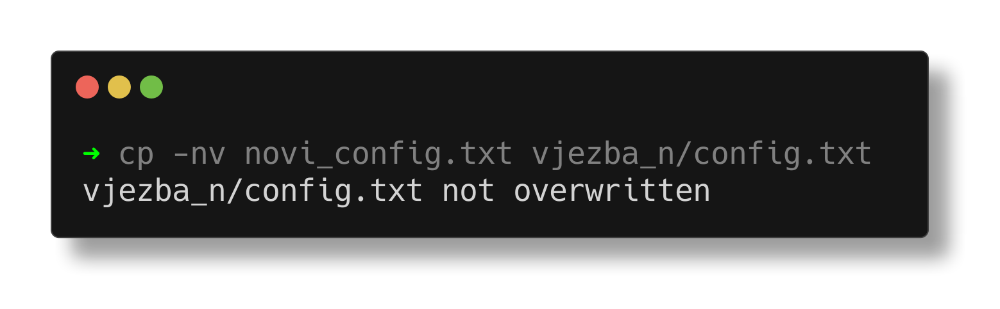
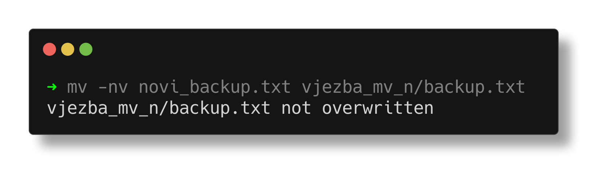

# Operacijski sustavi (OS)

**Nositelj**: doc. dr. sc. Ivan Lorencin
**Asistent**: Luka Blašković, mag. inf.

**Ustanova**: Sveučilište Jurja Dobrile u Puli, Fakultet informatike u Puli

</img>

# (2) Zastavice CLI naredbi

</img>

<div style="float: clear; margin-right:5px;">
Zastavice (<i>eng. flags</i>) su posebni argumenti koji modificiraju ponašanje naredbi u CLI sučelju. Do sad smo koristili argumente za prosljeđivanje putanje datoteka i direktorija, a danas ćemo se upoznati s zastavicama koje dodaju funkcionalnosti naredbama. Zastavice se često navode jednom (<code>-</code>) te služe prvenstveno za prilagodbu ponašanja naredbi, a ne za prosljeđivanje podataka. U ovom poglavlju studenti će se upoznati s osnovnim zastavicama naredbi koje smo već obradili i na taj način naučiti fleksibilnije i učinkovitije koristiti CLI sučelje.
</div>

<br>

<div style="float: clear; margin-right:5px;"> </div>
<br>

**🆙 Posljednje ažurirano:20.3.2025.**

## Sadržaj

- [Operacijski sustavi (OS)](#operacijski-sustavi-os)
- [(2) Zastavice CLI naredbi](#2-zastavice-cli-naredbi)
  - [Sadržaj](#sadržaj)
- [1. Uvod](#1-uvod)
- [2. Zastavice naredbe `ls`](#2-zastavice-naredbe-ls)
  - [🚩Zastavica: `-a`](#zastavica--a)
  - [🚩Zastavica: `-l`](#zastavica--l)
  - [🚩Zastavica: `-R`](#zastavica--r)
  - [2.1 Ostale zastavice naredbe `ls`](#21-ostale-zastavice-naredbe-ls)
  - [2.2 Tablica čestih zastavica naredbe `ls`](#22-tablica-čestih-zastavica-naredbe-ls)
- [3. Zastavice naredbi `cd`, `pwd`, `mkdir` i `rmdir`](#3-zastavice-naredbi-cd-pwd-mkdir-i-rmdir)
- [Zadatak 1: Vježba osnovnih zastavica](#zadatak-1-vježba-osnovnih-zastavica)
- [4. Zastavice naredbi `cp`, `mv` i `rm`](#4-zastavice-naredbi-cp-mv-i-rm)
  - [🚩Zastavica: `-i`](#zastavica--i)
  - [🚩Zastavica: `-r`](#zastavica--r-1)
  - [🚩Zastavica: `-v`](#zastavica--v)
  - [🚩Zastavica: `-f`](#zastavica--f)
  - [🚩Zastavica: `-n`](#zastavica--n)
  - [4.1 Tablica čestih zastavica naredbi `cp`, `mv` i `rm`](#41-tablica-čestih-zastavica-naredbi-cp-mv-i-rm)
- [Zadatak 2: Vježba zastavica naredbi `cp`, `mv` i `rm`](#zadatak-2-vježba-zastavica-naredbi-cp-mv-i-rm)
- [Zadaci za Vježbu 2](#zadaci-za-vježbu-2)

# 1. Uvod

Na prošlim vježbama naučili smo osnovne bash naredbe za rad s datotekama i direktorijima unutar CLI sučelja. CLI omogućava korisnicima interakciju s operacijskim sustavom putem teksta, a interpretaciju samih naredbi obavlja ljuska (_eng. shell_).

Vidjeli smo što su **apsolutna** i **relativna** putanja te kako ih koristimo kao argumente za naredbe. Također, naučili smo kako navigirati kroz direktorije, stvarati nove datoteke i direktorije te ih premještati i brisati.

U nastavku su navedene osnovne naredbe koje smo obradili, zajedno s opisima:

- `pwd` - ispisuje apsolutnu putanju trenutnog (radnog) direktorija
- `ls` - ispisuje sadržaj direktorija
- `cd` - mijenja trenutni direktorij
- `mkdir` - stvara novi direktorij
- `touch` - stvara novu datoteku
- `rm` - briše datoteku
- `rmdir` - briše direktorij (ako je prazan)
- `cp` - kopira datoteku ili direktorij
- `mv` - premješta datoteku ili direktorij
- `echo` - ispisuje tekst u terminal sučelju

U ovoj skripti studenti će se upoznati s konceptom **opcija**/**zastavica** (eng. _flags_) 🚩

<hr>

U bash skriptiranju, **zastavice** ili **opcije** (_eng. flags_) su posebni argumenti koji modificiraju ponašanje naredbi.

**Zastavice se obično koriste kako bi se naredbama dodale funkcionalnosti** ili kako bi se **promijenili neki interni parametri naredbe**.

Do sad nismo koristili zastavice, već smo "nadopunjavali" naredbe koristeći argumente (npr. putanje do datoteka i direktorija).

**Argumenti** (parametri) naredbi se obično koriste za prosljeđivanje podataka naredbi i navodimo ih nakon inicijalne naredbe:

```bash
→ naredba argument1 argument2 argument3 ... argumentN
```

_Primjeri:_

```bash
→ ls /mnt/c/Users

→ cp datoteka1.txt /mnt/c/Users

→ rm /mnt/c/Users/datoteka1.txt
```

**Zastavice** (opcije) se koriste za izmjenu ponašanja naredbi i navodimo ih nakon inicijalne naredbe, a obično se označavaju s `-` ili `--` (crtica ili dvostruka crtica):

- `-z` (kratka zastavica/kratki format)
- `--zastavica` (duga zastavica/dugi format)

```bash
→ naredba -z --zastavica2 -z3 ... --zastavicaN # uočite da zastavice mogu biti kratke (-z) ili duge (--zastavica)
```

Osim toga, moguće je i **vrlo često ćemo kombinirati argumente i zastavice**:

```bash
→ naredba -z1 --zastavica2 argument1 argument2
```

U pravilu se zastavice pišu **prije argumenata**, ali to nije uvijek slučaj. Neki programi mogu imati različite konvencije i dozvoljavaju različite redoslijede zastavica i argumenata.

Dakle, moguće je i sljedeće:

```bash
→ naredba argument1 -z1 argument2 --zastavica2 argument3
```

_Primjeri:_

```bash
→ ls -l /mnt/c/Users

→ cp -r vazni_dokumenti /mnt/c/Users/Desktop

→ mv -i script.js /home/user/Desktop/zadaca
```

Sintaksu koju smo pokazali na prošlim vježbama, na ovim vježbama ćemo proširiti dodavanjem zastavica. Dakle, naglasak će biti na zastavice osnovnih naredbi za rad s datotekama i direktorijima.

> Krenimo sa zastavicama! 🚩🚩🚩

<!-- omit in toc -->

# 2. Zastavice naredbe `ls`

**Sintaksa:**

```bash
→ ls [FLAGS] <putanja>
```

- zastavice `[FLAGS]` koristimo **prije putanje** kako bismo modificirali ispis
- `<putanja>` može biti apsolutna ili relativna putanja do direktorija

## 🚩Zastavica: `-a`

`-a` (zapamti kao "all") - lista sve datoteke, uključujući i one skrivene (koje počinju s `.`)

_Primjer:_

```bash
→ mkdir vjezba_2
→ touch vjezba_2/datoteka.txt
→ ls
```

</img>

> 🖼️ Naredba `ls` bez zastavice

Kako bismo dodali skrivenu datoteku, jednostavno dodajemo datoteku s točkom na početku:

```bash
→ touch .skrivena_datoteka.txt

→ ls # ne vidimo skrivenu datoteku

→ ls -a # vidimo skrivenu datoteku "skrivena_datoteka.txt"
```

</img>

> 🖼️ Naredba `ls` s zastavicom `-a` ispisuje skrivene datoteke

Ako bolje pogledate, osim skrivene datoteke `.skrivena_datoteka.txt`, vidimo i dva posebna direktorija: `.` i `..`.

Ovo su **specijalni direktoriji** koji predstavljaju:

- **trenutni** direktorij (`.`),
- **roditeljski** direktorij (`..`)

te se nalaze u svakom direktoriju datotečnog sustava. Mi smo ih do sada koristili u kontekstu naredbe `cd` kada smo se željeli vratiti u prethodni direktorij (`cd ..`).

Ove specijalne direktorije moguće je upotrebljavati i s drugim naredbama, kao što je `ls`.

Primjerice, ako se nalazimo unutar direktorija `vjezba_2` i želimo ispisati sadržaj roditeljskog direktorija, možemo koristiti:

```bash
→ ls ..
```

Ako bismo htjeli ispisati sadržaj roditeljskog direktorija roditeljskog direktorija (dakle, "grandparent" direktorij), koristili bismo:

```bash
→ ls ../..
```

Također, sljedeće naredbe su ekvivalentne:

```bash
→ ls
→ ls .
```

Ako koristite zadane postavke unutar GUI, skrivene datoteke i direktoriji **obično nisu vidljivi**.

</img>

> 🖼️ Datoteka `".skrivena_datoteka.txt"` nije vidljiva unutar GUI-a, ako koristite zadane postavke

- [Kako prikazati skrivene datoteke na Windows OS GUI](https://helpx.adobe.com/x-productkb/global/show-hidden-files-folders-extensions.html)
- [Kako prikazati skrivene datoteke/direktorije na macOS GUI](https://www.pcmag.com/how-to/how-to-access-your-macs-hidden-files)
- [Kako prikazati skrivene datoteke na Ubuntu/Linux OS GUI](https://help.ubuntu.com/stable/ubuntu-help/files-hidden.html.en)

Postoji varijanta ove zastavice s velikim slovom `-A` koja također ispisuje sve datoteke, ali ne ispisuje `.` i `..` direktorije.

```bash
→ ls -A # ne ispisuje skrivene direktorije "." i ".."
```

---

## 🚩Zastavica: `-l`

`-l` (zapamti kao "long") - ispisuje detaljan ispis datoteka i direktorija

```bash
→ cd vjezba_2
→ ls -l
```

</img>

> 🖼️ Naredba `ls -l` ispisuje detaljan ispis datoteka i direktorija

U detaljnom ispisu, svaki redak predstavlja jednu datoteku ili direktorij. Svaki redak sadrži sljedeće informacije:

1. **Tip datoteke i dozvole** - prva znamenka označava tip datoteke (`d` → direktorij, `l` → simbolička veza, `-` → obična datoteka, ...), a sljedeće tri znamenke predstavljaju dozvole za vlasnika, grupu i ostale korisnike (npr. `rwxr-xr--`)
2. **Broj čvrstih veza** (_eng. Hard links_) - broj datoteka koje pokazuju na isti čvor (čvor predstavlja jedinstveni identifikator datoteke/direktorija, odnosno datoteku ili direktorij unutar datotečnog sustava, _googlati_: "unix inode")
3. **Vlasnik** - računalni korisnik koji je vlasnik datoteke/direktorija
4. **Grupa** - grupa kojoj datoteka/direktorij pripada
5. **Veličina** - veličina datoteke u bajtovima (`B`)
6. **Datum i vrijeme posljednje izmjene** - datum i vrijeme kada je datoteka/direktorij zadnji put izmijenjen
7. **Naziv direktorija/datoteke** - naziv direktorija ili datoteke

_Primjer:_

Želimo pogledati detaljan ispis direktorija `Books` koji se nalazi u home direktoriju korisnika `username`:

```bash
→ ls -l /mnt/c/Users/username/Books
```

</img>

> 🖼️ Naredba `ls -l` za detaljni ispis sadržaja direktorija `Books`

Vrijednost `total` koja se ispisuje na početku detaljnog ispisa ne predstavlja broj datoteka/direktorija unutar radnog direktorija. Ova vrijednost predstavlja **ukupnu veličinu svih datoteka unutar direktorija u blokovima** (_eng. disc blocks_), a 1 blok obično ima veličinu od 1024 ili 512 bajtova, ovisno o datotečnom sustavu.

Ako bismo željeli uključiti i skrivene datoteke u naš detaljni ispis, jednostavno dodajemo zastavicu `-a`:

```bash
→ ls -l -a
```

**Redoslijed zastavica vrlo često nije bitan**, pa možemo koristiti i sljedeće:

```bash
→ ls -a -l
# ekvivalentno
→ ls -l -a
```

Ili specijalnu zastavicu koja uključuje oba ova ponašanja (`-la`):

```bash
→ ls -la
```

</img>

> 🖼️ Naredba `ls -l -a` za detaljni ispis sadržaja direktorija `Books` uključujući i skrivene datoteke

U ovoj skripti nećemo se detaljno baviti dozvolama, međutim za sad možete uočiti neke osnovne informacije iz ovog ispisa:

- `-` (crtica) - obična datoteka
- `d` (direktorij) - direktorij
- `r` (read) - dozvola za čitanje
- `w` (write) - dozvola za pisanje

Na primjeru od ranije:

- `drwxr-xr-x` - uočite da je prvi znak `d`, što znači da se radi o **direktoriju**, uočite i oznake `rw` što znači da vlasnik ima dozvolu za **čitanje i pisanje**
- `-rw-r--r--@` - uočite da je prvi znak `-`, što znači da se radi o **datoteci**, uočite i oznake `rw` što znači da vlasnik ima dozvolu za **čitanje i pisanje**

Za sada toliko! 😎

---

## 🚩Zastavica: `-R`

`-R` (zapamti kao "recursive") - rekurzivno ispisuje sadržaj ugniježđenih direktorija (eng. _subdirectories_)

_Primjer:_

Unutar direktorija `vjezba_2` definirat ćemo sljedeću strukturu direktorija i datoteka:

```bash
→ mkdir dir_1_razina_1
→ mkdir dir_2_razina_1
→ mkdir dir_3_razina_1

→ touch datoteka_1_razina_1.txt
→ touch datoteka_2_razina_1.txt

→ touch dir_1_razina_1/datoteka_1_razina_2.js
→ touch dir_1_razina_1/datoteka_2_razina_2.html
→ mkdir dir_1_razina_1/dir_1_razina_2

→ touch dir_2_razina_1/dir_1_razina_2/datoteka_1_razina_3.cpp
```

Očekujemo sljedeću strukturu:

```
[ 224]  .
├── [   0]  datoteka_1_razina_1.txt         # 1. razina
├── [   0]  datoteka_2_razina_1.txt         # 1. razina
├── [ 160]  dir_1_razina_1                  # 1. razina
│   ├── [   0]  datoteka_1_razina_2.js      # 2. razina
│   ├── [   0]  datoteka_2_razina_2.html    # 2. razina
│   └── [  96]  dir_1_razina_2              # 2. razina
│       └── [   0]  datoteka_1_razina_3.cpp # 3. razina
├── [  64]  dir_2_razina_1                  # 1. razina
└── [  64]  dir_3_razina_1                  # 1. razina
```

Naredbom `ls -R` ispisujemo sadržaj direktorija `vjezba_2` **rekurzivno**:

```bash
→ ls -R
```

</img>

> 🖼️ Naredba `ls -R` će za radni direktorij ispisati sve ugniježđene direktorije i datoteke unutar njih, rekurzivno

---

## 2.1 Ostale zastavice naredbe `ls`

Zastavica ima jako puno, pokazat ćemo još nekoliko korisnih koje se često koriste.

- `-h` (zapamti kao "human"): ispisuje veličine datoteka u ljudski čitljivom formatu (npr. `1K`, `36M`, `3G`). Kombinira se s `-l` zastavicom.

```bash
→ ls -l -h /mnt/c/Users/username/Books

# ili

→ ls -lh /mnt/c/Users/username/Books # kombiniranje zastavica -l i -h u -lh
```

</img>

> 🖼️ Naredba `ls -l -h` će ispisati veličine datoteka u ljudski čitljivom formatu

- `-t` (zapamti kao "time") sortira datoteke po vremenu zadnje izmjene (od **najnovijih** prema **najstarijima**).
- `-S` (zapamti kao "Size") sortira datoteke po veličini (od **najvećih** prema **najmanjima**).
- `-1` (zapamti kao "one") ispisuje svaku datoteku u zasebnom redu (korisno za ispis u skriptama).
- `--color` obojit će ispisane datoteke i direktorije (zadano: direktoriji su plave boje, datoteke crne, ...)

> 💡Hint: Kod naredbe `ls`, gotovo sve zastavice je moguće međusobno kombinirati (npr. `-la`, `-lR`, `-aR`). Ovo je najbolje naučiti _trial-and-error_ metodom.

_Primjeri kombiniranja zastavica:_

1. Detaljni ispis svih datoteka i direktorija u trenutnom direktoriju, sortiranih prema vremenu zadnje izmjene:

```bash
→ ls -lt # kombiniranjem: -l (detaljan ispis), -t (sortiranje prema vremenu)
```

2. Detaljni ispis svih datoteka i direktorija u trenutnom direktoriju, uključujući i skrivene datoteke, sortiranih po veličini:

```bash
→ ls -laS # kombiniranjem: -l (detaljan ispis), -a (sve datoteke), -S (sortiranje po veličini)
```

3. Rekurzivni detaljni ispis svih datoteka i direktorija u trenutnom direktoriju, sortiranih prema vremenu zadnje izmjene:

```bash
→ ls -lRt # kombiniranjem: -l (detaljan ispis), -R (rekurzivno), -t (sortiranje prema vremenu)
```

4. Običan ispis svih datoteka i direktorija u trenutnom direktoriju, svaki zapis u novom redu:

```bash
→ ls -1
```

5. Ispis svih datoteka i direktorija, uključujući skrivene ali bez `.` i `..` direktorija, obojene, svaki zapis u novom redu:

```bash
# nalazimo se unutar direktorija: "vjezba_2"
→ ls -A --color -1
```

</img>

> 🖼️ Naredba `ls -A --color -1` će ispisati sve datoteke i direktorije, uključujući skrivene ali bez `.` i `..`, obojene i svaki podatak u zasebnom redu.

## 2.2 Tablica čestih zastavica naredbe `ls`

| Zastavica | Sintaksa                        | Objašnjenje                                                                                                         |
| --------- | ------------------------------- | ------------------------------------------------------------------------------------------------------------------- |
| `-l`      | `ls -l` / `ls -l -h` / `ls -lh` | Detaljan popis datoteka/direktorija s dozvolama, vlasnikom, grupom, veličinom i datumom izmjene i drugim detaljima. |
| `-a`      | `ls -a`                         | Prikazuje sve datoteke, uključujući skrivene (`.` i `..`).                                                          |
| `-A`      | `ls -A`                         | Prikazuje skrivene datoteke, ali bez `.` i `..`.                                                                    |
| `-h`      | `ls -h` / `ls -l -h` / `ls -lh` | Prikazuje veličine u čitljivom formatu (`B`, `K`, `M`, `G`).                                                        |
| `-t`      | `ls -t` / `ls -l -t` / `ls -lt` | Sortira datoteke prema vremenu izmjene (najnovije prve).                                                            |
| `-r`      | `ls -r` / `ls -l -r` / `ls -lr` | Prikazuje popis datoteka/direktorija obrnutim redoslijedom.                                                         |
| `-R`      | `ls -R` / `ls -l -R` / `ls -lR` | Rekurzivno ispisuje sadržaj svih poddirektorija.                                                                    |
| `-1`      | `ls -1`                         | Prikazuje popis datoteka/direktorija u jednom stupcu (svaku u posebni redak)                                        |
| `-X`      | `ls -X` / `ls -l -X` / `ls -lX` | Sortira datoteke prema ekstenziji.                                                                                  |
| `--color` | `ls --color`                    | Prikazuje datoteke u boji prema tipu datoteke.                                                                      |

> **Napomena:** zastavice treba izvježbati i koristiti u praksi kako bi se bolje razumjele i zapamtile. Neke zastavice nije moguće kombinirati, primjerice zastavice `d` i `l` ne mogu se koristiti zajedno jer su međusobno kontradiktorne.

> 💡Hint: Kod svih bash naredbi je moguće koristiti uputstva ili _manual_ naredbom `man`, npr. `man ls` za detaljne upute kako koristiti naredbu `ls` i koje su sve zastavice dostupne uključujući njihova ograničenja. Iz manuala se izlazi pritiskom tipke `q`

# 3. Zastavice naredbi `cd`, `pwd`, `mkdir` i `rmdir`

Naredba `cd` nema zastavica i koristi se isključivo s argumentima (putanjama).

Naredba `pwd` ima dvije zastavice (`-L` i `-P`) međutim ne koriste se često pa ih nećemo niti spominjati.

Naredbe `mkdir` i `rmdir` imaju korisnu zastavicu `-p` koja omogućava **stvaranje/brisanje više ugniježđenih direktorija odjednom**.

U prošloj skripti, rekli smo da ne možemo napraviti direktorij unutar nepostojećeg direktorija, odnosno:

```bash
# ne možemo stvoriti direktorij "test" unutar nepostojećeg direktorija "files_manipulation"
→ mkdir files_manipulation/test
```

- Ipak, zastavica `-p` će nam isto omogućiti 🙂

```bash
→ mkdir -p files_manipulation/test

# pa i više ugniježđenih direktorija
# Primjer: stvaranje ugniježđenih direktorija "dir1/dir2/dir3"
→ mkdir -p dir1/dir2/dir3
```

Ekvivalentno možemo koristiti i naredbu `rmdir -p` za brisanje ugniježđenih direktorija, ako su prazni:

```bash
→ rmdir -p dir1/dir2/dir3 # briše sva 3 direktorija, ako su prazni
```

---

<div style="page-break-after: always; break-after: page;"></div>

# Zadatak 1: Vježba osnovnih zastavica

- ne predaje se (samo za vježbu)

1. Stvorite direktorij `vjezba_ls` i unutar njega stvorite sljedeću strukturu direktorija i datoteka koristeći isključivo `mkdir` i `touch` naredbe:

   - ugniježđene direktorije stvorite koristeći odgovarajuću zastavicu

```
[  96]  .
└── [ 128]  faks
    ├── [ 256]  1_semestar
    │   ├── [   0]  diferencijalni_i_integralni_racun.txt
    │   ├── [   0]  logika_i_diskretna_mat.txt
    │   ├── [   0]  multimedijalni_sustavi.txt
    │   ├── [   0]  osnove_ikt.txt
    │   ├── [   0]  osnove_podatkovne_znanosti.txt
    │   └── [   0]  programiranje.txt
    └── [ 256]  2_semestar
        ├── [   0]  baze_podataka_1.txt
        ├── [   0]  geometrija_i_linearna_algebra.txt
        ├── [   0]  informacijski_sustavi.txt
        ├── [   0]  matematicka_analiza.txt
        ├── [   0]  operacijski_sustavi.txt
        └── [   0]  programiranje_u_skriptnim_jezicima.txt
```

2. Unutar direktorija `vjezba_ls` ispišite rekurzivno sadržaj direktorija `faks`, u boji, svaku datoteku u zasebnom redu bez skrivenih datoteka.

```bash
faks

./faks:
1_semestar
2_semestar

./faks/1_semestar:
diferencijalni_i_integralni_racun.txt
logika_i_diskretna_mat.txt
multimedijalni_sustavi.txt
osnove_ikt.txt
osnove_podatkovne_znanosti.txt
programiranje.txt

./faks/2_semestar:
baze_podataka_1.txt
geometrija_i_linearna_algebra.txt
informacijski_sustavi.txt
matematicka_analiza.txt
operacijski_sustavi.txt
programiranje_u_skriptnim_jezicima.txt
```

3. Unutar direktorija `vjeba_ls` ispišite **detaljne** informacije datoteka iz 1. semestra, sortiranih po datumu zadnje izmjene - od najnovije prema najstarijoj.

```bash
total 0
-rw-r--r--  1 lukablaskovic  staff  0 Mar 19 00:07 osnove_ikt.txt
-rw-r--r--  1 lukablaskovic  staff  0 Mar 19 00:07 multimedijalni_sustavi.txt
-rw-r--r--  1 lukablaskovic  staff  0 Mar 19 00:07 programiranje.txt
-rw-r--r--  1 lukablaskovic  staff  0 Mar 19 00:07 logika_i_diskretna_mat.txt
-rw-r--r--  1 lukablaskovic  staff  0 Mar 19 00:07 diferencijalni_i_integralni_racun.txt
-rw-r--r--  1 lukablaskovic  staff  0 Mar 19 00:08 osnove_podatkovne_znanosti.txt
```

4. U drugi semestar dodajte tajni kolegij koji je skrivena datoteka i **detaljno** ispišite sve datoteke iz 2. semestra uključujući i skrivene datoteke, bez `.` i `..` direktorija.

```bash
total 0
-rw-r--r--  1 lukablaskovic  staff  0 Mar 19 00:15 .tajni_kolegij.txt
-rw-r--r--  1 lukablaskovic  staff  0 Mar 19 00:08 baze_podataka_1.txt
-rw-r--r--  1 lukablaskovic  staff  0 Mar 19 00:08 geometrija_i_linearna_algebra.txt
-rw-r--r--  1 lukablaskovic  staff  0 Mar 19 00:08 informacijski_sustavi.txt
-rw-r--r--  1 lukablaskovic  staff  0 Mar 19 00:08 matematicka_analiza.txt
-rw-r--r--  1 lukablaskovic  staff  0 Mar 19 00:08 operacijski_sustavi.txt
-rw-r--r--  1 lukablaskovic  staff  0 Mar 19 00:09 programiranje_u_skriptnim_jezicima.txt
```

5. Ako se nalazite u direktoriju `faks/2_semestar`, objasnite 2 načina kako biste dodali novu datoteku `.tajni_kolegij.txt` u direktorij `faks/1_semestar` bez da se prebacujete u taj direktorij, tj. bez korištenja naredbe `cd`.

<div style="page-break-after: always; break-after: page;"></div>

# 4. Zastavice naredbi `cp`, `mv` i `rm`

U ovom dijelu pokrit ćemo zastavice naredbi `cp` (kopiranje), `mv` (premještanje) i `rm` (brisanje), koje omogućuju precizniju kontrolu nad njihovim ponašanjem.

Ove tri naredbe imaju dosta zastavica koje se ponavljaju i međusobno su slične, stoga ćemo ih obraditi zajedno.

**Sintaksa:**

```bash
→ cp [FLAGS] <izvorna_datoteka> <ciljna_datoteka>

→ mv [FLAGS] <izvorna_datoteka> <ciljna_datoteka>

→ rm [FLAGS] <izvorna_datoteka>
```

- zastavice `[FLAGS]` koristimo **prije** izvorne datoteke
- `<izvorna_datoteka>` i `<ciljna_datoteka>` mogu biti apsolutne ili relativne putanje do datoteka

## 🚩Zastavica: `-i`

`-i` (zapamti kao "interactive") - prije kopiranja/premještanja/brisanja datoteke, **zastavica će pitati korisnika za potvrdu**. Zastavica je korisna u slučajevima kada želimo izbjeći slučajnu izmjenu važnih datoteka, pogotovo kad radimo s više datoteka odjednom ili kad radimo s datotekama koje su važne za rad operacijskog sustava.

- zastavica `-i` unutar `cp` će pitati korisnika za potvrdu **samo ako datoteka već postoji na odredištu** (_eng. overwrite_)
- zastavica `-i` unutar `mv` će pitati korisnika za potvrdu **samo ako datoteka već postoji na odredištu** (_eng. overwrite_)
- zastavica `-i` unutar `rm` će pitati korisnika za potvrdu **uvijek prije brisanja datoteke** (pitat će za svaku datoteku)

_Primjeri:_

```bash
→ cp -i datoteka.txt /mnt/c/Users/username/Desktop # naredba će pitati korisnika prije kopiranja datoteke samo ako "datoteka.txt" već postoji na odredištu

# ili

→ mv -i datoteka.txt /mnt/c/Users/username/Desktop # pitaj korisnika prije premještanja datoteke na odredište ako "datoteka.txt" već postoji

# ili

→ rm -i datoteka.txt # pitaj korisnika prije brisanja datoteke svaki put
```

Korisnik odgovara na pitanje s `y` (_yes_) ili `n` (_no_), odnosno **unosom odgovarajućeg slova** i pritiskom tipke `Enter`.

_Primjer:_

```bash
→ mkdir system_32
→ touch system_32/super_important_file.exe

→ rm -i system_32/super_important_file.exe
```

Nakon izvršavanja naredbe, korisnik će dobiti sljedeći ispis:

```bash
→ rm: remove system_32/super_important_file.exe?
```

- Ako korisnik odgovori s `y` i pritisne `Enter`, datoteka će biti obrisana
- Ako korisnik odgovori s `n` **ili bilo kojim drugim znakom** i pritisne `Enter`, datoteka neće biti obrisana

</img>

> 🖼️ Naredba `rm -i` će pitati korisnika je li siguran u brisanje datoteke, svaki put

## 🚩Zastavica: `-r`

`-r` (zapamti kao "recursive") - kopira/briše direktorij i **sav njegov sadržaj rekurzivno**. Pomoću ove zastavice moguće je kopirati/brisati direktorije i sve datoteke/poddirektorije unutar njih u jednom koraku.

- ovo ponašanje je zadano kod naredbe `mv` (premještanje) pa iz tog razloga nema zastavice `-r` kod naredbe `mv`
- zastavicu `-r` je moguće pisati i velikim slovom: `-R` (kod naredbe `ls` ove zastavice nisu ekvivalentne)

Kod **kopiranja** (`cp`) smo rekli da možemo kopirati određenu datoteku ili direktorij iz mjesta `<izvor>` u mjesto `<odrediše>`:

```bash
→ cp <izvor> <odredište>
```

- gdje izvor i odredište mogu biti relativne ili apsolutne putanje

Do sad smo vidjeli primjere gdje kopiramo:

- jedan direktorij u drugi direktorij → (`cp dir dir2`)
- jednu datoteku u drugi direktorij → (`cp datoteka.txt dir`)
- jednu datoteku u drugu datoteku (s istim ili različitim nazivom) → (`cp datoteka.txt datoteka2.txt`)

Međutim, **što ako želimo kopirati cijeli direktorij, uključujući sav njegov sadržaj**, u drugi direktorij? Tada je potrebno koristiti rekurzivnu zastavicu `-r`:

```bash
→ cp -r <izvor> <odredište>
```

_Primjer s rekurzivnim kopiranjem:_

```bash
→ mkdir vjezba_cp_r

→ mkdir vjezba_cp_r/dir1

→ cd vjezba_cp_r/dir1
→ touch datoteka1.txt datoteka2.txt datoteka3.txt

→ ls -1

# Primjer: kopirat ćemo sav sadržaj direktorija "dir1" u direktorij "vjezba_cp_r/dir2"

→ cp -r . ../dir2 # "dir2" će biti stvoren unutar "vjezba_cp_r", ako ne postoji
```

Kod **premještanja** (`mv`), rekurzivno ponašanje je zadano i ne navodi se eksplicitno ovom zastavicom:

```bash
mv <izvor> <odredište> # nema zastavice -r
```

_Primjer:_

```bash
→ mkdir vjezba_mv

→ mkdir vjezba_mv/dir1

→ cd vjezba_mv/dir1
→ touch script1.js script2.js script3.js

→ mkdir ../dir2

# nalazimo se unutar: /vjezba2/vjezba_mv
# Primjer: premještanje cijelog direktorija sa sadržajem u drugi direktorij (dir1 -> dir2)
→ mv dir1 dir2 # premješta "dir1" u "dir2"
```

Ipak, ako bi htjeli premjestiti samo sadržaj direktorija `dir1` u `dir2`, a ne cijeli direktorij, moramo koristiti tzv. "wildcard" - znak `*`.

Općenito, [Wildcard](https://tldp.org/LDP/GNU-Linux-Tools-Summary/html/x11655.htm) se koristi kad želimo radnju izvršiti nad više datoteka odjednom (konkretno: wildcard `*` predstavlja **sve datoteke** unutar nekog direktorija).

**Sintaksa:**

```bash
naredba dir1/dir2/wildcard # wildcard nije zastavica, već poseban znak unutar putanje!
```

```bash
→ mv dir1/* dir2 # premješta sve datoteke iz "dir1" u "dir2"

# "dir1" je sad prazan
# "dir2" sadrži sve datoteke iz "dir1"
```

- Ako postoji previše datoteka unutar direktorija, wildcard `*` može dati grešku: "Argument list too long".

Kod **brisanja** (`rm`) moramo biti posebno oprezni jer rekurzivno brisanje direktorija i njegovog sadržaja može biti **nepovratno**.

```bash
rm -r <direktorij>
```

_Primjer rekurzivnog brisanja:_

```bash
→ mkdir vjezba_rm_r

→ mkdir vjezba_rm_r/dir1

→ cd vjezba_rm_r/dir1

→ touch touch cache1.txt cache2.txt cache3.txt cache4.txt

→ ls -1

# nalazimo se unutar: /vjezba2/vjezba_rm_r
# Primjer: rekurzivno brisanje direktorija "dir1" i svih datoteka unutar njega
→ rm -r dir1
```

> 🚨Oprez: **Rekurzivno brisanje direktorija i njegovog sadržaja može biti opasno**, stoga je potrebno biti oprezan i provjeriti je li odabrani direktorij ispravan prije brisanja. Ipak, dobra praksa je kombinirati zastavicu `r` zastavicom `i` koja će u tom slučaju pitati korisnika je li siguran u brisanje za svaku datoteku. Ipak, većina modernih Linux distribucija ima neki oblik zaštita (_safeguards_) koje preveniraju rekurzivno brisanje korijenskog direktorija.

_Primjer rekurzivnog brisanja s potvrdom:_

```bash
mkdir system_32

touch system_32/super_important_file.exe
touch system_32/another_important_file.exe
touch system_32/settings.json

# Primjer: rekurzivno brisanje direktorija "system_32" s potvrdom za svaku datoteku
rm -ri system_32
```

Na ovaj način naredba `rm` će:

- pitati korisnika za pregled svakog direktorija (`examine`)
- pitati korisnika je li siguran u brisanje svake datoteke (`remove`)
- pitati korisnika je li siguran u brisanje ukupnog direktorija (`remove directory`)
- korisnik odgovara s `y` ili `n` i pritiskom tipke `Enter` na jednak način kao do sada

</img>

> 🖼️ Naredba `rm -ri` će pitati korisnika je li siguran u brisanje svake datoteke i direktorija, svaki put.

## 🚩Zastavica: `-v`

`-v` (zapamti kao "verbose") - ispisuje detalje o radnji koja se izvršava (npr. ispisuje datoteke koje se kopiraju/premještaju/brišu)

Izraz _verbose_ je općenit pojam koji označava "govorljivost" ili "detaljnost" ispisivanja informacija. U kontekstu naredbi `cp`, `mv` i `rm`, zastavica `-v` će ispisivati **detalje o radnji koja se izvršava**.

```bash
→ cp -v datoteka.txt /mnt/c/Users/username/Desktop # ispisuje detalje o kopiranju datoteke

→ mv -v datoteka.txt /mnt/c/Users/username/Desktop # ispisuje detalje o premještanju datoteke

→ rm -v datoteka.txt # ispisuje detalje o brisanju datoteke
```

_Primjer s detaljima o kopiranju:_

```bash
mkdir vjezba_v

touch vjezba_v/datoteka1.txt

cp -v vjezba_v/datoteka1.txt vjezba_v/datoteka2.txt # kopira datoteku i preimenuje je, ispisuje detalje o radnji
```

</img>

> 🖼️ Zastavica `-v` će ispisati detaljne informacije o promjenama koje su se dogodile, konkretno: `vjezba_v/datoteka1.txt -> vjezba_v/datoteka2.txt`

_Primjer s detaljima o rekurzivnom brisanju i potvrdama:_

```bash
mkdir vjezba_v_rm

cd vjezba_v_rm

touch spam1.txt spam2.txt spam3.txt spam4.txt

# Primjer: kombinirat ćemo zastavice -v, -i i -r za upit prije brisanja svake datoteke i ispisati obrisanu datoteku/direktorij nakon svake operacije
rm -vir vjezba_v_rm
```

</img>

> 🖼️ Kombiniranje zastavica `-v`, `-i` i `-r` će ispisati detalje o brisanju svake datoteke i pitati korisnika za potvrdu svake radnje

<div style="page-break-after: always; break-after: page;"></div>

## 🚩Zastavica: `-f`

`-f` (zapamti kao "force") - **forsira izvršavanje naredbe** bez traženja potvrde i bez prikazivanja upozorenja ako datoteka ne postoji. Ova zastavica se koristi kada želimo zaobići potvrde i greške, što može biti korisno, ali i opasno ako nismo pažljivi.

Zastavica `-f` se koristi kod naredbi `cp`, `mv` i `rm`:

- kada želimo obrisati **datoteke ili direktorije** bez potvrde (`rm -f`)
- kada želimo prepisati (_eng. overwrite_) postojeće datoteke prilikom kopiranja (`cp -f`)
- kada želimo premjestiti datoteke i prepisati postojeće bez upozorenja (`mv -f`)

Zastavica `-f` **može dovesti do nepovratnog gubitka podataka**. Preporučuje se koristiti samo kada ste sigurni da želite prisilno izvršiti operaciju.

_Primjer brisanja bez potvrde:_

```bash
mkdir vjezba_f

cd vjezba_f

touch osjetljiva_datoteka.txt

# Brisanje bez potvrde
rm -f osjetljiva_datoteka.txt
```

Kako bismo demonstrirali rad ove zastavice, moramo imati datoteke različitog sadržaja.

Upis u datoteku možemo napraviti pomoću naredbe `echo` i operatora `>`:

**Sintaksa:**

```bash
echo "string_sadrzaj" > datoteka.txt
```

- za sada dovoljno, a detalje ćemo raditi na sljedećim vježbama 😎

_Primjer kopiranja bez potvrde:_

```bash
mkdir vjezba_cp_f

touch vjezba_cp_f/backup.log

echo "Stari podaci" > vjezba_cp_f/backup.log # sintaksa za upis u datoteku (radit ćemo ovo kasnije)

# Stvaramo novu datoteku s novim podacima
echo "Novi podaci" > novi_backup.log # sintaksa za upis u datoteku (radit ćemo ovo kasnije)

# Kopiramo i prepisujemo datoteku bez upozorenja
cp -f novi_backup.log vjezba_cp_f/backup.log
```

_Primjer premještanja bez potvrde:_

```bash
mkdir vjezba_mv_f

touch vjezba_mv_f/old_config.cfg

echo "Stara konfiguracija" > vjezba_mv_f/old_config.cfg

# Kreiramo novu konfiguracijsku datoteku
echo "Nova konfiguracija" > new_config.cfg

# Premještamo i prepisujemo bez upozorenja
mv -f new_config.cfg vjezba_mv_f/old_config.cfg
```

🚨**Opasna kombinacija zastavica** `-f` i `-r` može dovesti do rekurzivnog brisanja sadržaja direktorija bez potvrde!

_Primjer rekurzivnog brisanja bez potvrde:_

```bash
mkdir -p vjezba_rm_rf/temp

touch vjezba_rm_rf/temp/file1.txt vjezba_rm_rf/temp/file2.txt

# Brisanje cijelog direktorija bez upita
rm -rf vjezba_rm_rf
```

> 💡Hint: Ako niste sigurni u radnju, preporuka je izbjegavati `-f` ili koristiti `-i` zastavicu za potvrdu.

## 🚩Zastavica: `-n`

`-n` (zapamti kao "no overwrite") - sprječava prepisivanje postojećih datoteka prilikom kopiranja (`cp`) ili premještanja (`mv`). Ova zastavica je korisna kada **ne želimo izgubiti postojeće podatke slučajnim prepisivanjem**.

Zastavica `-n` će **preskočiti kopiranje/premještanje datoteke ako već postoji na odredištu** i koristimo ju:

- **kada kopiramo ili premještamo datoteke**, ali ne želimo prebrisati postojeće datoteke
- kada želimo **zaštititi stare verzije datoteka**
- kada ne želimo ručno potvrđivati svaku zamjenu (`-i`), već jednostavno **automatski spriječiti prepisivanje**

Praktično je kombinirati `-n` i `-v` zastavice za bolju vidljivost i kontrolu nad radnjama:

_Primjer s kopiranjem:_

```bash
mkdir vjezba_n

echo "Prva verzija" > vjezba_n/config.txt

echo "Najnovija verzija" > novi_config.txt

# Kopiramo, ali ne prepisujemo ako "config.txt" već postoji
cp -n novi_config.txt vjezba_n/config.txt

# Kombiniranje s -v za ispis detalja
cp -nv novi_config.txt vjezba_n/config.txt
```

</img>

> 🖼️ Naredba `cp` s kombinacijom zastavica ``-n` i `-v` će ispisati detalje o radnji i neće prepisati datoteku ako već postoji

_Primjer s premještanjem:_

```bash
mkdir vjezba_mv_n

echo "Originalna verzija" > vjezba_mv_n/backup.txt

echo "Nova verzija" > novi_backup.txt

# Premještamo, ali ne prepisujemo ako "backup.txt" već postoji
mv -n novi_backup.txt vjezba_mv_n/backup.txt

# Kombiniranje s -v za ispis detalja
mv -nv novi_backup.txt vjezba_mv_n/backup.txt
```

</img>

> 🖼️ Naredba `mv` s kombinacijom zastavica ``-n` i `-v` će ispisati detalje o radnji i neće prepisati datoteku ako već postoji

## 4.1 Tablica čestih zastavica naredbi `cp`, `mv` i `rm`

| Zastavica | Sintaksa                    | Objašnjenje                                                                                          |
| --------- | --------------------------- | ---------------------------------------------------------------------------------------------------- |
| `-i`      | `cp -i` / `mv -i` / `rm -i` | **Interaktivni način** – traži potvrdu prije prepisivanja (`cp`, `mv`) ili brisanja (`rm`) datoteke. |
| `-r`      | `cp -r` / `rm -r`           | **Rekurzivno kopira** (`cp`) ili briše (`rm`) direktorij i sve njegove poddirektorije i datoteke.    |
| `-R`      | `cp -R` / `rm -R`           | Isto kao `-r` (za `cp` i `rm`). Kod `ls` ove zastavice nisu ekvivalentne.                            |
| `-v`      | `cp -v` / `mv -v` / `rm -v` | **Prikazuje detalje** o izvršenim operacijama (`verbose`).                                           |
| `-f`      | `cp -f` / `mv -f` / `rm -f` | **Forsira izvršenje** – ne traži potvrdu i ne prikazuje upozorenja ako datoteka ne postoji.          |
| `-n`      | `cp -n` / `mv -n`           | **Onemogućuje prepisivanje** postojećih datoteka (ne utječe na `rm`).                                |
| `-u`      | `cp -u` / `mv -u`           | Kopira ili premješta samo ako je izvorna datoteka novija od ciljne ili ako ciljna ne postoji.        |

> 💡 **Napomena:** Naredba `mv` ponaša se rekurzivno prema direktorijima po defaultu, pa nema `-r` opciju. Kod `rm` se `-r` koristi pažljivo jer može trajno obrisati velike količine podataka.

# Zadatak 2: Vježba zastavica naredbi `cp`, `mv` i `rm`

- ne predaje se (samo za vježbu)

1. Stvorite direktorij `vjezba_cp_mv_rm` i unutar njega stvorite sljedeću strukturu direktorija koristeći isključivo `mkdir` naredbu

- naredbu `mkdir` **smijete pozvati najviše 5puta**. Hint: zastavica

```bash
[ 160]  .
├── [ 128]  Documents
│   ├── [  64]  faks
│   └── [  64]  sve_ostalo
├── [ 160]  Games
│   ├── [  64]  action
│   ├── [  64]  puzzle
│   └── [  64]  sandbox
```

2. Koristeći `touch` naredbu, unutar direktorija `sve_ostalo` stvorite sljedeće datoteke:

```
salabahter_ikt.txt
salabahter_os.txt
salabahter_programiranje.txt
```

- stvorite novu datoteku `salabahter_ikt.txt` unutar direktorija `faks` i unesite u nju sadržaj: `"Salabahter iz IKT-a"` naredbom `echo`
- kopirajte odjednom sadržaj direktorija `sve_ostalo` u direktorij `faks`, ne prepisujte datoteku koja već postoji i ispišite detalje o radnji

3. Unutar `games` direktorija stvorite 5 datoteka jednom naredbom, a koje predstavljaju kratice (_shortcut_ - s nastavkom `.lnk`) na igre koje spadaju u kategorije `action`, `puzzle` i `sandbox`.

- `minecraft.lnk`
- `portal2.lnk`
- `DOOM.lnk`
- `the_witness.lnk`
- `the_legends_of_zelda.lnk`

Koristeći naredbe `cp` i `mv`, premjestite datoteke u odgovarajuće direktorije i ispišite detalje o radnji. Neke igre se mogu nalaziti u više kategorija pa morate kopirati datoteke, a ne premještati.

1. action i puzzle: `minecraft.lnk`
2. puzzle i action: `portal2.lnk`
3. action: `DOOM.lnk`
4. puzzle: `the_witness.lnk`
5. action, puzzle i sandbox: `the_legends_of_zelda.lnk`

Napišite naredbu koja rekurzivno briše sadržaj direktorija `Games` i pitajte korisnika za potvrdu prije brisanja svake datoteke. Ovom interakcijom obrišite samo datoteke (kratice), direktorije ostavite netaknute (ali prazne).

# Zadaci za Vježbu 2

Zadaću predajete na Merlin prema uputama za predaju.

Zadatke riješite izvršavanjem naredbi u kloniranom GitHub repozitoriju, tako da se vide rezultati. Sve naredbe i odgovore upišite u `vjezba_2.txt` datoteku.

**Zadatak 1**

U radnom okruženju stvorite direktorije `vjezba_2/data` i `vjezba_2/backup` koristeći dvije naredbe `mkdir`.

Unutar direktorija `data` stvorite sljedeće datoteke:

```bash
script.js
style.css
.env
```

Naredbom `echo` unesite sljedeći sadržaj u datoteke:

- `script.js`: `console.log("Hello, World!")`
- `style.css`: `body { background-color: #f0f0f0; }`
- `.env`: `VJEBE=OS`

**Zadatak 2**

Kopirajte sav sadržaj direktorija `data` u direktorij `backup` koristeći odgovarajuću naredbu. Ispišite detalje o radnji.

Prebacite se u direktorij `data` i napravite detaljan ispis direktorija `backup`. Ispis mora biti detaljan, uključivati sve skrivene datoteke i biti sortiran po veličini.

**Zadatak 3**

Jednom naredbom izbrišite sve datoteke i direktorij `data` osim datoteke `.env` koristeći odgovarajuće zastavice. Ispišite detalje o radnji.

Napravite ponovno direktorij `data` i kopirajte u njega sve datoteke iz direktorija `backup` koristeći odgovarajuću naredbu, ali spriječite prepisivanje datoteka koje već postoje. Ispišite detalje o radnji.

Detaljno ispišite sadržaj direktorija `data` koji mora sadržavati skrivene datoteke osim pokazivača na trenutni i radni direktorij, sortirane po datumu zadnje izmjene i svaki zapis u novom redu.

**Zadatak 4**

Otvorite direktorij po želji, ali nek ne sadržava više od 20 datoteka - mora sadržavati ugniježđene direktorije s nekoliko datoteka unutar njih.

Prebacite se u direktorij i napišite sljedeće naredbe:

1. Izlistaj detaljno sadržaj glavnog direktorija, uključujući sve skrivene datoteke i sortiraj po veličini.
2. Izlistaj detaljno sadržaj glavnog direktorija, bez skrivenih datoteka, sortiraj po veličini i prikaži jedinice (KB, MB, GB) uz veličinu datoteka.
3. Izlistaj sav sadržaj direktorija (uključujući poddirektorije i njihove datoteke i skrivene datoteke), ispis neka bude u boji i sortiran po datumu zadnje izmjene (najnovije na početku).
