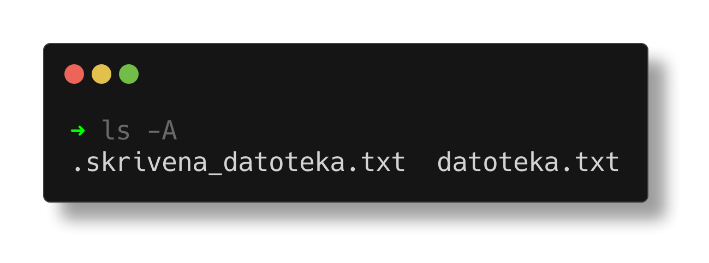

# Operacijski sustavi (OS)

**Nositelj**: doc. dr. sc. Ivan Lorencin
**Asistent**: Luka Blašković, mag. inf.

**Ustanova**: Sveučilište Jurja Dobrile u Puli, Fakultet informatike u Puli

</img>

# (2) Zastavice CLI naredbi

</img>

<div style="float: clear; margin-right:5px;">
Zastavice (<i>eng. flags ili options</i>) predstavljaju posebnu vrstu argumenata koji se koriste za izmjenu ili proširenje zadanog ponašanja naredbi u CLI sučelju. Za razliku od argumenata koje smo dosad koristili prvenstveno za prosljeđivanje konkretnih podataka, poput putanja do datoteka ili direktorija, zastavice služe za parametrizaciju načina izvršavanja naredbe, odnosno za uključivanje dodatnih funkcionalnosti ili promjenu načina prikaza i obrade rezultata.

U pravilu se zastavice navode uz prefiks jedne crtice (<code>-</code>) za kratke oblike ili dviju crtica (<code>--</code>) za duže, opisne oblike. Njihova je osnovna svrha kontrola ponašanja naredbe, a ne prijenos sadržajnih podataka. Primjerice, zastavicom se može zatražiti detaljniji prikaz informacija, rekurzivna obrada direktorija ili sortiranje izlaza prema određenom kriteriju.

U ovom poglavlju studenti će se upoznati s najčešće korištenim zastavicama osnovnih bash naredbi iz cjeline OS1. Time će steći dublje razumijevanje fleksibilnosti CLI okruženja te razviti sposobnost učinkovitijeg i preciznijeg upravljanja radom u terminalu.

</div>

<div style="clear: both; margin-right:5px;"> </div>
<br>

**🆙 Posljednje ažurirano: 18.3.2026.**

## Sadržaj

- [Operacijski sustavi (OS)](#operacijski-sustavi-os)
- [(2) Zastavice CLI naredbi](#2-zastavice-cli-naredbi)
  - [Sadržaj](#sadržaj)
- [1. Uvod](#1-uvod)
- [2. Zastavice naredbe `ls`](#2-zastavice-naredbe-ls)
  - [🚩Zastavice: `-a` i `-A`](#zastavice--a-i--a)
  - [🚩Zastavica: `-l`](#zastavica--l)
  - [🚩Zastavica: `-R`](#zastavica--r)
  - [2.1 Ostale zastavice naredbe `ls`](#21-ostale-zastavice-naredbe-ls)
  - [2.2 Tablica čestih zastavica naredbe `ls`](#22-tablica-čestih-zastavica-naredbe-ls)
- [3. Zastavice naredbi `cd`, `pwd`, `mkdir` i `rmdir`](#3-zastavice-naredbi-cd-pwd-mkdir-i-rmdir)
- [Zadatak 1: Vježba osnovnih zastavica](#zadatak-1-vježba-osnovnih-zastavica)
- [4. Zastavice naredbi `cp`, `mv` i `rm`](#4-zastavice-naredbi-cp-mv-i-rm)
  - [🚩Zastavica: `-i`](#zastavica--i)
  - [🚩Zastavica: `-r`](#zastavica--r-1)
  - [🚩Zastavica: `-v`](#zastavica--v)
  - [🚩Zastavica: `-f`](#zastavica--f)
  - [🚩Zastavica: `-n`](#zastavica--n)
  - [4.1 Tablica čestih zastavica naredbi `cp`, `mv` i `rm`](#41-tablica-čestih-zastavica-naredbi-cp-mv-i-rm)
- [Zadatak 2: Vježba zastavica naredbi `cp`, `mv` i `rm`](#zadatak-2-vježba-zastavica-naredbi-cp-mv-i-rm)
- [5. Praktični primjer: Git CLI](#5-praktični-primjer-git-cli)
- [Zadaci za Vježbu 2](#zadaci-za-vježbu-2)

# 1. Uvod

Na prošlim vježbama naučili smo osnovne bash naredbe za rad s datotekama i direktorijima unutar CLI sučelja. CLI omogućuje korisnicima interakciju s operacijskim sustavom putem tekstualnih naredbi, a interpretaciju samih naredbi obavlja ljuska (_eng. shell_).

Vidjeli smo što su **apsolutna** i **relativna** putanja te kako ih koristimo kao argumente za naredbe. Također, naučili smo kako navigirati kroz direktorije, stvarati nove datoteke i direktorije te ih premještati, preimenovati, kopirati i brisati kroz odgovarajuće naredbe.

U nastavku su navedene osnovne naredbe koje smo obradili, zajedno s opisima:

- `pwd` - ispisuje apsolutnu putanju trenutnog (radnog) direktorija
- `ls` - ispisuje sadržaj direktorija
- `cd` - mijenja trenutni direktorij
- `mkdir` - stvara novi direktorij
- `touch` - stvara novu datoteku
- `rm` - briše datoteku
- `rmdir` - briše direktorij (ako je prazan)
- `cp` - kopira datoteku ili direktorij
- `mv` - premješta datoteku ili direktorij
- `echo` - ispisuje tekst u terminalu ili preusmjerava tekst u datoteku

U ovoj skripti studenti će se upoznati s konceptom **opcija**, odnosno **zastavica** (_eng. options/flags_) 🚩

<hr>

U _bashu_, **zastavice** ili **opcije** (_eng. flags_) posebni su argumenti koji modificiraju ponašanje naredbi.

**Zastavice se obično koriste kako bi se naredbama dodale funkcionalnosti** ili kako bi se **promijenili neki interni parametri naredbe**.

Do sada nismo koristili zastavice, već smo naredbe nadopunjavali argumentima (npr. putanjama do datoteka i direktorija).

**Argumenti** (parametri) naredbi obično se koriste za prosljeđivanje podataka naredbi i navodimo ih nakon same naredbe:

```bash
→ naredba argument1 argument2 argument3 ... argumentN
```

_Primjeri argumenata:_

```bash
→ ls /mnt/c/Users

→ cp datoteka1.txt /mnt/c/Users

→ rm /mnt/c/Users/datoteka1.txt
```

**Zastavice** (opcije) se koriste za izmjenu ponašanja naredbi i navodimo ih nakon inicijalne naredbe, a obično se označavaju s `-` ili `--` (crtica ili dvostruka crtica):

- `-z` (kratka zastavica/kratki format)
- `--zastavica` (duga zastavica/dugi format)

```bash
→ naredba -a --zastavica2 -n ... --zastavicaN # uočite da zastavice mogu biti kratke (-a, `-n`) ili duge (--zastavica2, --zastavicaN)
```

Osim toga, vrlo često kombiniramo argumente i zastavice:

```bash
→ naredba -z --zastavica2 argument1 argument2 # 2 zastavice i 2 argumenta
```

U pravilu se zastavice pišu **prije argumenata**, ali to nije uvijek slučaj. Neki CLI programi mogu imati različite konvencije i dozvoljavaju različite redoslijede zastavica i argumenata.

Dakle, moguće je i sljedeće:

```bash
→ naredba argument1 -z argument2 --zastavica2 argument3 # argument1 ovdje se odnosi na "naredba", dok se argumenti argument2 i argument3 odnose na zastavice -z odnosno --zastavica2
```

- izgleda zbunjujuće, ali bit će jasnije kod naredbe `tree` koju ćemo obraditi kasnije

_Primjeri korištenja zastavica u kombinaciji s argumentima:_

```bash
→ ls -l /mnt/c/Users

→ cp -r vazni_dokumenti /mnt/c/Users/Desktop

→ mv -i script.js /home/user/Desktop/zadaca
```

Sintaksu koju smo pokazali na prošlim vježbama sada ćemo proširiti dodavanjem zastavica. Naglasak će biti na zastavicama osnovnih naredbi za rad s datotekama i direktorijima.

> Krenimo sa zastavicama! 🚩🚩🚩

<!-- omit in toc -->

# 2. Zastavice naredbe `ls`

**Sintaksa:**

```bash
→ ls [FLAGS] <putanja>
```

- zastavice `[FLAGS]` koristimo **prije putanje** kako bismo modificirali ispis
- `<putanja>` može biti apsolutna ili relativna putanja do datoteke ili direktorija

## 🚩Zastavice: `-a` i `-A`

`-a` (zapamti kao "all") → ispisuje sve datoteke/direktorije, uključujući i one skrivene (koje počinju s `.`)

`-A` (zapamti kao "almost all") → ispisuje sve datoteke/direktorije, uključujući i one skrivene, ali **ne** uključuje posebne direktorije `.` i `..`

_Primjer:_

```bash
→ mkdir vjezba_2
→ touch vjezba_2/datoteka.txt
→ cd vjezba_2
→ ls
```

</img>

> Slika 1. Naredba `ls` bez zastavice

Kako bismo dodali skrivenu datoteku, jednostavno dodajemo datoteku s točkom na početku:

```bash
→ touch .skrivena_datoteka.txt

→ ls # ne vidimo skrivenu datoteku

→ ls -a # vidimo skrivenu datoteku ".skrivena_datoteka.txt"
```

</img>

> Slika 2. Naredba `ls` sa zastavicom `-a` ispisuje skrivene datoteke

Ako bolje pogledate, osim skrivene datoteke `.skrivena_datoteka.txt`, vidimo i dva posebna direktorija: `.` i `..`.

Ovo su **specijalni pokazivači na direktorije** koji predstavljaju:

- **trenutni** direktorij (`.`),
- **roditeljski** direktorij (`..`)

te se nalaze u svakom direktoriju datotečnog sustava. U kontekstu naredbe `cd`, `cd ..` koristimo kada se želimo vratiti u roditeljski direktorij. Za povratak u prethodni radni direktorij koristi se `cd -`.

Ove specijalne direktorije moguće je upotrebljavati i s drugim naredbama, kao što je `ls`.

Primjerice, ako se nalazimo unutar direktorija `vjezba_2` i želimo ispisati sadržaj roditeljskog direktorija, možemo koristiti:

```bash
→ ls ..
```

Ako bismo htjeli ispisati sadržaj roditeljskog direktorija roditeljskog direktorija, koristili bismo:

```bash
→ ls ../..
```

Također, sljedeće naredbe su ekvivalentne:

```bash
→ ls
→ ls .
```

Ako koristite zadane postavke unutar grafičkog sučelja (GUI), skrivene datoteke i direktoriji **obično nisu vidljivi**.

</img>

> Slika 3. Datoteka `.skrivena_datoteka.txt` često nije vidljiva u GUI-ju ako se koriste zadane postavke

- [Kako prikazati skrivene datoteke na Windows OS GUI](https://helpx.adobe.com/x-productkb/global/show-hidden-files-folders-extensions.html)
- [Kako prikazati skrivene datoteke/direktorije na macOS GUI](https://www.pcmag.com/how-to/how-to-access-your-macs-hidden-files)
- [Kako prikazati skrivene datoteke na Ubuntu/Linux OS GUI](https://help.ubuntu.com/stable/ubuntu-help/files-hidden.html.en)

**Postoji varijanta ove zastavice s velikim slovom** `-A` koja također ispisuje sve datoteke, ali ne ispisuje posebne direktorije `.` i `..`.

```bash
→ ls -A # ne ispisuje posebne direktorije "." i ".."
```

#### Naredbe `open/xdg-open` <!-- omit in toc -->

Kada koristimo OS s grafičkim sučeljem, možemo provjeriti rezultat izvršavanja naših `bash` naredbi i u GUI-ju.

Na **macOS-u** naredba `open` omogućuje otvaranje datoteke ili direktorija u GUI-ju.

Na većini **Linux** distribucija sličnu ulogu ima naredba `xdg-open`.

Primjerice, ako se nalazimo unutar direktorija `vjezba_2` i želimo otvoriti trenutni direktorij, možemo upotrijebiti pokazivač na trenutni direktorij `.`:

```bash
→ open . # macOS

→ xdg-open . # Linux
```

U WSL okruženju naredba `open` u pravilu nije dostupna kao na macOS-u, pa se za otvaranje direktorija u Windows GUI-ju najčešće koristi `explorer.exe`.

```bash
→ explorer.exe .
```

Na ovaj način ćete pokrenuti program Windows File Explorer i otvoriti trenutni direktorij (`vjezba_2`) u GUI-ju

Prilikom korištenja `ls -A` nećete vidjeti `.` i `..`, ali ćete i dalje vidjeti skrivene datoteke koje počinju s `.`.

</img>

> Slika 4. Naredba `ls -A` ispisuje skrivene datoteke, ali ne ispisuje posebne direktorije `.` i `..`

## 🚩Zastavica: `-l`

`-l` (zapamti kao "long") → ispisuje detaljan prikaz datoteka i direktorija

```bash
→ cd vjezba_2
→ ls -l
```

</img>

> Slika 5. Naredba `ls -l` ispisuje detaljan prikaz datoteka i direktorija

U detaljnom ispisu, svaki redak predstavlja jednu datoteku ili direktorij. Svaki redak sadrži sljedeće informacije:

1. **Tip datoteke i dozvole** - prvi znak označava tip datoteke (`d` → direktorij, `l` → simbolička veza, `-` → obična datoteka, ...), a sljedećih devet znakova predstavljaju dozvole za vlasnika, grupu i ostale korisnike (npr. `rwxr-xr--`)
2. **Broj čvrstih poveznica** (_eng. hard links_) - broj zapisa koji upućuju na isti inode, odnosno isti zapis unutar datotečnog sustava
3. **Vlasnik** - računalni korisnik koji je vlasnik datoteke/direktorija
4. **Grupa** - grupa kojoj datoteka/direktorij pripada
5. **Veličina** - veličina datoteke u bajtovima (`B`)
6. **Datum i vrijeme posljednje izmjene** - datum i vrijeme kada je datoteka/direktorij zadnji put izmijenjen
7. **Naziv direktorija/datoteke** - naziv direktorija ili datoteke

_Primjer:_

Želimo pogledati detaljan ispis direktorija `Books` koji se nalazi u _home_ direktoriju korisnika `username`:

```bash
→ ls -l /mnt/c/Users/username/Books
```

</img>

> Slika 6. Naredba `ls -l` za detaljan ispis sadržaja direktorija `Books`

Vrijednost `total` koja se ispisuje na početku detaljnog ispisa ne predstavlja broj datoteka ili direktorija unutar radnog direktorija. Ona predstavlja **ukupan broj blokova koje zauzimaju prikazane stavke**, a točna veličina bloka ovisi o datotečnom sustavu i implementaciji naredbe `ls`.

Ako bismo željeli uključiti i skrivene datoteke u naš detaljni ispis, jednostavno dodajemo zastavicu `-a`:

```bash
→ ls -l -a
```

**ZAPAMTI!** Redoslijed <u>kratkih</u> zastavica u pravilu nije bitan, sve dok pojedina zastavica ne očekuje dodatni argument.

```bash
→ ls -a -l
# ekvivalentno
→ ls -l -a
```

Ili spojeni zapis kratkih zastavica koji uključuje oba ova ponašanja (`-la`):

```bash
→ ls -la
# ili
→ ls -al
# Sve isto!
```

</img>

> Slika 7. Naredba `ls -l -a` za detaljan ispis sadržaja direktorija `Books`, uključujući i skrivene datoteke

U ovoj skripti nećemo se detaljno baviti dozvolama, ali već možete uočiti neke osnovne informacije iz ovog ispisa:

- `-` (crtica) - obična datoteka
- `d` (direktorij) - direktorij
- `r` (read) - dozvola za čitanje
- `w` (write) - dozvola za pisanje
- `x` (execute) - dozvola za izvršavanje

Na primjeru od ranije:

- `drwxr-xr-x` - prvi znak `d` znači da se radi o **direktoriju**, a oznake `rwx` znače da vlasnik ima dozvolu za **čitanje, pisanje i izvršavanje**
- `-rw-r--r--` - uočite da je prvi znak `-`, što znači da se radi o **datoteci**, uočite i oznake `rw` što znači da vlasnik ima dozvolu za **čitanje i pisanje**, ali nema dozvolu za izvršavanje `x`

Za sada toliko! Detaljnije o dozvolama u cjelini OS5. 😎

---

## 🚩Zastavica: `-R`

`-R` (zapamti kao "recursive") → rekurzivno ispisuje sadržaj ugniježđenih direktorija (_eng. subdirectories_)

_Primjer:_

Unutar direktorija `vjezba_2` definirat ćemo sljedeću strukturu direktorija i datoteka:

```bash
→ mkdir dir_1_razina_1
→ mkdir dir_2_razina_1
→ mkdir dir_3_razina_1

→ touch datoteka_1_razina_1.txt
→ touch datoteka_2_razina_1.txt

→ touch dir_1_razina_1/datoteka_1_razina_2.js
→ touch dir_1_razina_1/datoteka_2_razina_2.html
→ mkdir dir_1_razina_1/dir_1_razina_2

→ touch dir_1_razina_1/dir_1_razina_2/datoteka_1_razina_3.cpp
```

Očekujemo sljedeću strukturu:

```
[ 224]  .
├── [   0]  datoteka_1_razina_1.txt         # 1. razina
├── [   0]  datoteka_2_razina_1.txt         # 1. razina
├── [ 160]  dir_1_razina_1                  # 1. razina
│   ├── [   0]  datoteka_1_razina_2.js      # 2. razina
│   ├── [   0]  datoteka_2_razina_2.html    # 2. razina
│   └── [  96]  dir_1_razina_2              # 2. razina
│       └── [   0]  datoteka_1_razina_3.cpp # 3. razina
├── [  64]  dir_2_razina_1                  # 1. razina
└── [  64]  dir_3_razina_1                  # 1. razina
```

Naredbom `ls -R` ispisujemo sadržaj direktorija `vjezba_2` **rekurzivno**:

```bash
→ ls -R
```

</img>

> Slika 8. Naredba `ls -R` rekurzivno ispisuje sadržaj ugniježđenih direktorija i datoteka

#### Naredba `tree` <!-- omit in toc -->

Digresija: Naredba `tree` također ispisuje sadržaj direktorija rekurzivno, ali u obliku stabla. Ova naredba ponekad nije dostupna na svim operacijskim sustavima, ali se može vrlo jednostavno instalirati.

Možete provjeriti dostupnost naredbe `tree` na vašem sustavu pokretanjem:

```bash
→ tree --version
```

Ako nije instalirana, na Ubuntu/Linux OS možete je instalirati naredbom:

```bash
→ sudo apt install tree
# ili
→ brew install tree # za macOS s Homebrew upraviteljem paketa
```

> **💡 Hint**: Naredba sudo doslovno znači superuser do. Riječ je o jednoj od najčešće korištenih CLI naredbi u Unix-like sustavima (Linux, macOS). Omogućuje pokretanje naredbe ili skripte s ovlastima superkorisnika (root), odnosno s najvišim sigurnosnim privilegijama u sustavu.

**Sintaksa:**

```bash
→ tree [FLAGS] <putanja>
```

Primjer korištenja naredbe `tree`:

```bash
→ tree
```

Bez zastavica i argumenata, naredba `tree` **rekurzivno ispisuje sadržaj trenutnog direktorija u obliku stabla**.

```
.
└── datoteka.txt
```

Ako bismo htjeli vidjeti skrivenu datoteku `.skrivena_datoteka.txt`, dodajemo zastavicu `-a`:

```bash
→ tree -a
```

Rezultat:

```
.
├── .skrivena_datoteka.txt
└── datoteka.txt
```

Što uočavate? Zastavica `-a` kod naredbe `tree` također uključuje skrivene datoteke, ali ne i posebne direktorije `.` i `..`. Ipak, na početku ispisa vidimo `.` koji predstavlja trenutni direktorij iz kojeg pozivamo CLI naredbu.

Prema tome, možete uočiti da implementacije CLI programa, kao što je to `tree`, mogu uključivati srodne zastavice koje imaju slično ponašanje kao i kod drugih naredbi, ali nisu nužno identične.

Ako biste htjeli ispisati "stablo" _home_ (matičnog) direktorija, mogli biste koristiti:

```bash
→ tree ~
```

> **💡 Hint**: `~` (tilda) je ugrađeni prečac koji se u ljusci proširuje na korisnikov home direktorij. Ne znate gdje se nalazi na tipkovnici? Google it

> **Oprez!** Pokretanjem ove naredbe krenut ćete rekurzivno ispisivati sav sadržaj vašeg home direktorija, što može rezultirati vrlo velikim i skupim izlazom. **Kako biste prekinuli izvršavanje naredbe**, koristite kraticu `Ctrl + C` odnosno `Cmd + C` na macOS-u.

Kako bismo reducirali ispis na nekoliko razina, možemo koristiti zastavicu `-L` (zapamti kao "level"):

```bash
→ tree -L 2 ~ # ispisuje sadržaj home direktorija do 2 razine ugniježđenosti
```

Što je sad ovo! Ova naredba izgleda čudno jer smo proslijedili naizgled 3 argumenta: `-L`, `2` i `~`. Međutim, `-L` je zastavica koja očekuje dodatni argument koji specificira broj razina, a `~` je zaseban argument koji predstavlja putanju do home direktorija.

Moguće je napisati i obrnutim redoslijedom, bitno je da se pridržavamo sintakse gdje se zastavica `-L` koristi s odgovarajućim argumentom:

```bash
→ tree ~ -L 2 # isto kao iznad
```

Želimo uključiti i skrivene datoteke u naš ispis - nema problema!

```bash
→ tree -a -L 2 ~
```

Ako rastavimo naredbu iznad na dijelove, imamo:

- `tree` - naredba koja ispisuje sadržaj direktorija u obliku stabla
- `-a` - zastavica koja uključuje skrivene datoteke
- `-L 2` - zastavica s argumentom koja ograničava ispis na 2 razine ugniježđenosti
- `~` - argument koji predstavlja putanju do home direktorija

---

## 2.1 Ostale zastavice naredbe `ls`

Naredba `ls` ima mnogo zastavica; pokazat ćemo još nekoliko korisnih koje se često koriste.

- `-h` (zapamti kao "human") → ispisuje veličine datoteka u ljudski čitljivom formatu (npr. `1K`, `36M`, `3G`). Najčešće se kombinira sa zastavicom `-l`.

```bash
→ ls -l -h /mnt/c/Users/username/Books

# ili

→ ls -lh /mnt/c/Users/username/Books # kombiniranje zastavica -l i -h u -lh
```

</img>

> Slika 9. Naredba `ls -l -h` ispisuje veličine datoteka u "ljudski čitljivom" formatu

- `-t` (zapamti kao "time") → sortira datoteke po vremenu zadnje izmjene (od **najnovijih** prema **najstarijima**).
- `-S` (zapamti kao "Size") → sortira datoteke po veličini (od **najvećih** prema **najmanjima**).
- `-1` (zapamti kao "one") → ispisuje svaku datoteku u zasebnom redu (korisno za ispis u skriptama).
- `--color` (u GNU `ls`) → obojit će ispis prema tipu stavke; točne boje ovise o temi i postavkama terminala, na macOS-u je tipično koristiti zastavicu `-G` umjesto `--color`.

> **💡Hint**: Kod naredbe `ls` gotovo je sve zastavice moguće međusobno kombinirati (npr. `-la`, `-lR`, `-aR`).

_Primjeri kombiniranja zastavica:_

1. Detaljni ispis svih datoteka i direktorija u trenutnom direktoriju, sortiranih prema vremenu zadnje izmjene:

```bash
→ ls -lt # kombiniranjem: -l (detaljan ispis), -t (sortiranje prema vremenu)
```

2. Detaljni ispis svih datoteka i direktorija u trenutnom direktoriju, uključujući i skrivene datoteke, sortiranih po veličini:

```bash
→ ls -laS # kombiniranjem: -l (detaljan ispis), -a (sve datoteke), -S (sortiranje po veličini)
```

3. Rekurzivni detaljni ispis svih datoteka i direktorija u trenutnom direktoriju, sortiranih prema vremenu zadnje izmjene (od najnovijih prema najstarijima):

```bash
→ ls -lR -t # kombiniranjem: -l (detaljan ispis), -R (rekurzivno), -t (sortiranje prema vremenu zadnje izmjene od najnovijih prema najstarijima)
```

4. Običan ispis svih datoteka i direktorija u trenutnom direktoriju, svaki zapis u novom redu:

```bash
→ ls -1
```

5. Ispis svih datoteka i direktorija, uključujući skrivene ali bez `.` i `..` direktorija, obojene, svaki zapis u novom redu:

```bash
# nalazimo se unutar direktorija: "vjezba_2"
→ ls -A --color -1
```

</img>

> Slika 10. Naredba `ls -A --color -1` ispisuje sve datoteke i direktorije, uključujući skrivene, ali bez `.` i `..`, obojeno i sa svakom stavkom u zasebnom retku

## 2.2 Tablica čestih zastavica naredbe `ls`

| Zastavica | Primjeri kombiniranja           | Objašnjenje                                                                                                         |
| --------- | ------------------------------- | ------------------------------------------------------------------------------------------------------------------- |
| `-l`      | `ls -l` / `ls -l -h` / `ls -lh` | Detaljan popis datoteka/direktorija s dozvolama, vlasnikom, grupom, veličinom i datumom izmjene i drugim detaljima. |
| `-a`      | `ls -a`                         | Prikazuje sve stavke, uključujući skrivene datoteke i direktorije te posebne direktorije `.` i `..`.                |
| `-A`      | `ls -A`                         | Prikazuje skrivene datoteke, ali bez `.` i `..`.                                                                    |
| `-h`      | `ls -h` / `ls -l -h` / `ls -lh` | Prikazuje veličine u čitljivom formatu (`B`, `K`, `M`, `G`).                                                        |
| `-t`      | `ls -t` / `ls -l -t` / `ls -lt` | Sortira datoteke prema vremenu izmjene (najnovije prve).                                                            |
| `-r`      | `ls -r` / `ls -l -r` / `ls -lr` | Prikazuje popis datoteka/direktorija obrnutim redoslijedom.                                                         |
| `-R`      | `ls -R` / `ls -l -R` / `ls -lR` | Rekurzivno ispisuje sadržaj svih poddirektorija.                                                                    |
| `-1`      | `ls -1`                         | Prikazuje popis datoteka/direktorija u jednom stupcu (svaku stavku u posebnom retku).                               |
| `-X`      | `ls -X` / `ls -l -X` / `ls -lX` | Sortira datoteke prema ekstenziji.                                                                                  |
| `--color` | `ls --color`                    | Prikazuje ispis u boji prema tipu stavke (GNU `ls`).                                                                |

> 💡**Napomena:** zastavice treba izvježbati i koristiti u praksi kako bi se bolje razumjele i zapamtile. Također, nisu sve zastavice dostupne u svakoj implementaciji naredbe `ls`; primjerice `--color` tipičan je za GNU `ls`.

> **💡Hint**: Kod većine naredbi pomoć je moguće otvoriti naredbom `man`, npr. `man ls` za detaljne upute o naredbi `ls` i dostupnim zastavicama. Za Bash ugrađene naredbe, poput `cd` i `pwd`, često je praktično koristiti i `help cd` ili `help pwd`. Iz prikaza `man` izlazi se pritiskom tipke `q`.

# 3. Zastavice naredbi `cd`, `pwd`, `mkdir` i `rmdir`

Naredba `cd` ima opcije `-L` i `-P`, ali se u osnovnom radu koriste rijetko pa ih ovdje nećemo detaljno obrađivati.

Naredba `pwd` također ima dvije opcije (`-L` i `-P`), no ni njima se u ovoj skripti nećemo detaljnije baviti.

Naredbe `mkdir` i `rmdir` imaju korisnu zastavicu `-p` koja kod `mkdir` omogućuje stvaranje, a kod `rmdir` brisanje više ugniježđenih direktorija odjednom.

U prošloj skripti, rekli smo da ne možemo napraviti direktorij unutar nepostojećeg direktorija, odnosno:

```bash
# ne možemo stvoriti direktorij "test" unutar nepostojećeg direktorija "files_manipulation"
→ mkdir files_manipulation/test
```

- Ipak, zastavica `-p` omogućit će upravo to.

```bash
→ mkdir -p files_manipulation/test

# pa i više ugniježđenih direktorija
# Primjer: stvaranje ugniježđenih direktorija "dir1/dir2/dir3"
→ mkdir -p dir1/dir2/dir3
```

Ekvivalentno možemo koristiti i naredbu `rmdir -p` za brisanje ugniježđenih direktorija, ako su prazni:

```bash
→ rmdir -p dir1/dir2/dir3 # pokušat će obrisati dir3, zatim dir2, a zatim dir1, ali samo ako su prazni
```

---

<div style="page-break-after: always; break-after: page;"></div>

# Zadatak 1: Vježba osnovnih zastavica

- ne predaje se (samo za vježbu)

1. Stvorite direktorij `vjezba_ls` i unutar njega stvorite sljedeću strukturu direktorija i datoteka koristeći isključivo `mkdir` i `touch` naredbe:
   - ugniježđene direktorije stvorite koristeći odgovarajuću zastavicu naredbe `mkdir`
   - datoteke možete stvoriti i jednom naredbom `touch`, jednostavno navodeći sve datoteke koje želite stvoriti kao argumente

```
[  96]  .
└── [ 128]  faks
    ├── [ 256]  1_semestar
    │   ├── [   0]  diferencijalni_i_integralni_racun.txt
    │   ├── [   0]  logika_i_diskretna_mat.txt
    │   ├── [   0]  multimedijalni_sustavi.txt
    │   ├── [   0]  osnove_ikt.txt
    │   ├── [   0]  osnove_podatkovne_znanosti.txt
    │   └── [   0]  programiranje.txt
    └── [ 256]  2_semestar
        ├── [   0]  baze_podataka_1.txt
        ├── [   0]  geometrija_i_linearna_algebra.txt
        ├── [   0]  informacijski_sustavi.txt
        ├── [   0]  matematicka_analiza.txt
        ├── [   0]  operacijski_sustavi.txt
        └── [   0]  programiranje_u_skriptnim_jezicima.txt
```

2. Unutar direktorija `vjezba_ls` ispišite rekurzivno sadržaj direktorija `faks`, u boji, svaku stavku u zasebnom redu bez skrivenih datoteka.

```bash
faks

./faks:
1_semestar
2_semestar

./faks/1_semestar:
diferencijalni_i_integralni_racun.txt
logika_i_diskretna_mat.txt
multimedijalni_sustavi.txt
osnove_ikt.txt
osnove_podatkovne_znanosti.txt
programiranje.txt

./faks/2_semestar:
baze_podataka_1.txt
geometrija_i_linearna_algebra.txt
informacijski_sustavi.txt
matematicka_analiza.txt
operacijski_sustavi.txt
programiranje_u_skriptnim_jezicima.txt
```

3. Unutar direktorija `vjezba_ls` ispišite **detaljan** prikaz datoteka iz 1. semestra, sortiran po datumu zadnje izmjene, od najnovije prema najstarijoj.

```bash
total 0
-rw-r--r--  1 lukablaskovic  staff  0 Mar 19 00:08 osnove_podatkovne_znanosti.txt
-rw-r--r--  1 lukablaskovic  staff  0 Mar 19 00:07 osnove_ikt.txt
-rw-r--r--  1 lukablaskovic  staff  0 Mar 19 00:07 multimedijalni_sustavi.txt
-rw-r--r--  1 lukablaskovic  staff  0 Mar 19 00:07 programiranje.txt
-rw-r--r--  1 lukablaskovic  staff  0 Mar 19 00:07 logika_i_diskretna_mat.txt
-rw-r--r--  1 lukablaskovic  staff  0 Mar 19 00:07 diferencijalni_i_integralni_racun.txt
```

4. U drugi semestar dodajte tajni kolegij koji je skrivena datoteka i **detaljno** ispišite sve datoteke iz 2. semestra uključujući i skrivene datoteke, bez `.` i `..` direktorija.

```bash
total 0
-rw-r--r--  1 lukablaskovic  staff  0 Mar 19 00:15 .tajni_kolegij.txt
-rw-r--r--  1 lukablaskovic  staff  0 Mar 19 00:09 programiranje_u_skriptnim_jezicima.txt
-rw-r--r--  1 lukablaskovic  staff  0 Mar 19 00:08 baze_podataka_1.txt
-rw-r--r--  1 lukablaskovic  staff  0 Mar 19 00:08 geometrija_i_linearna_algebra.txt
-rw-r--r--  1 lukablaskovic  staff  0 Mar 19 00:08 informacijski_sustavi.txt
-rw-r--r--  1 lukablaskovic  staff  0 Mar 19 00:08 matematicka_analiza.txt
-rw-r--r--  1 lukablaskovic  staff  0 Mar 19 00:08 operacijski_sustavi.txt
```

5. Ako se nalazite u direktoriju `faks/2_semestar`, objasnite dva načina kako biste dodali novu datoteku `.tajni_kolegij.txt` u direktorij `faks/1_semestar` bez prebacivanja u taj direktorij, tj. bez korištenja naredbe `cd`.

6. Jednom _bash_ naredbom ispišite stablasti prikaz vašeg _home_ direktorija do 3 razine ugniježđenosti, uključujući skrivene datoteke, ali bez `.` i `..` direktorija. Nakon toga, pokušajte CLI naredbom otvoriti taj direktorij u GUI-ju.

<div style="page-break-after: always; break-after: page;"></div>

# 4. Zastavice naredbi `cp`, `mv` i `rm`

U ovom dijelu pokrit ćemo zastavice naredbi `cp` (kopiranje), `mv` (premještanje) i `rm` (brisanje), koje omogućuju precizniju kontrolu nad njihovim ponašanjem.

Ove tri naredbe imaju dosta zastavica koje se ponavljaju i međusobno su slične, stoga ćemo ih obraditi zajedno.

**Sintaksa:**

```bash
→ cp [FLAGS] <izvor> <odredište>

→ mv [FLAGS] <izvor> <odredište>

→ rm [FLAGS] <putanja>
```

- zastavice `[FLAGS]` u pravilu navodimo **prije** izvora i odredišta
- `<izvor>`, `<odredište>` i `<putanja>` mogu biti apsolutne ili relativne putanje; kod `cp` i `mv` to mogu biti i datoteke i direktoriji

## 🚩Zastavica: `-i`

`-i` (zapamti kao "interactive") → prije kopiranja/premještanja/brisanja datoteke, **zastavica će pitati korisnika za potvrdu**. Zastavica je korisna u slučajevima kada želimo izbjeći slučajnu izmjenu važnih datoteka, pogotovo kad radimo s više datoteka odjednom ili kad radimo s datotekama koje su važne za rad operacijskog sustava.

- zastavica `-i` unutar `cp` će pitati korisnika za potvrdu **samo ako datoteka već postoji na odredištu** (_eng. overwrite_)
- zastavica `-i` unutar `mv` će pitati korisnika za potvrdu **samo ako datoteka već postoji na odredištu**
- zastavica `-i` kod naredbe `rm` traži potvrdu prije svakog brisanja stavke, a u kombinaciji s `-r` može tražiti potvrdu i pri ulasku u direktorije te pri njihovu uklanjanju.

_Primjeri:_

```bash
→ cp -i datoteka.txt /mnt/c/Users/username/Desktop # naredba će pitati korisnika prije kopiranja datoteke samo ako "datoteka.txt" već postoji na odredištu

# ili

→ mv -i datoteka.txt /mnt/c/Users/username/Desktop # pitaj korisnika prije premještanja datoteke na odredište ako "datoteka.txt" već postoji

# ili

→ rm -i datoteka.txt # pitaj korisnika prije brisanja datoteke svaki put
```

Korisnik odgovara na pitanje s `y` (_yes_) ili `n` (_no_), odnosno **unosom odgovarajućeg slova** i pritiskom tipke `Enter`.

_Primjer:_

```bash
→ mkdir system_32
→ touch system_32/super_important_file.exe

→ rm -i system_32/super_important_file.exe
```

Nakon izvršavanja naredbe, korisnik će dobiti sljedeći ispis:

```bash
rm: remove system_32/super_important_file.exe?
```

- Ako korisnik odgovori s `y` i pritisne `Enter`, datoteka će biti obrisana
- Ako korisnik odgovori s `n` **ili bilo kojim drugim znakom** i pritisne `Enter`, datoteka neće biti obrisana

</img>

> Slika 11. Naredba `rm -i` traži potvrdu prije brisanja datoteke

## 🚩Zastavica: `-r`

`-r` (zapamti kao "recursive") → kopira ili briše direktorij i **sav njegov sadržaj rekurzivno**. Pomoću ove zastavice moguće je kopirati ili obrisati direktorije i sve datoteke/poddirektorije unutar njih u jednom koraku.

- ovo ponašanje je već zadano kod naredbe `mv` (premještanje) pa iz tog razloga nema zastavice `-r` kod iste
- zastavicu `-r` je moguće pisati i velikim slovom: `-R` (pripazi: kod naredbe `ls` ove zastavice nisu ekvivalentne, a kod naredbi `cp` i `rm` najčešće jesu - uvijek je dobro provjeriti u dokumentaciji CLI programa koji koristite)

Kod **kopiranja** (`cp`) rekli smo da možemo kopirati određenu datoteku ili direktorij iz mjesta `<izvor>` u mjesto `<odredište>`:

```bash
→ cp <izvor> <odredište>
```

- gdje izvor i odredište mogu biti relativne ili apsolutne putanje

Do sada smo vidjeli primjere gdje kopiramo:

- jedan direktorij u drugi direktorij rekurzivno → (`cp -r dir dir2`)
- jednu datoteku u drugi direktorij → (`cp datoteka.txt dir`)
- jednu datoteku u drugu datoteku (s istim ili različitim nazivom) → (`cp datoteka.txt datoteka2.txt`)

Međutim, **što ako želimo kopirati cijeli direktorij, uključujući sav njegov sadržaj**, u drugi direktorij? Tada je potrebno koristiti rekurzivnu zastavicu `-r`:

```bash
→ cp -r <izvor> <odredište>
```

_Primjer s rekurzivnim kopiranjem:_

```bash
→ mkdir vjezba_cp_r

→ mkdir vjezba_cp_r/dir1

→ cd vjezba_cp_r/dir1
→ touch datoteka1.txt datoteka2.txt datoteka3.txt

→ cd ..
→ mkdir dir2

# Primjer: kopirat ćemo cijeli direktorij "dir1" u direktorij "dir2"
→ cp -r dir1 dir2
```

Kod **premještanja** (`mv`), rekurzivno ponašanje je zadano i ne navodi se eksplicitno ovom zastavicom:

```bash
mv <izvor> <odredište> # nema zastavice -r
```

_Primjer:_

```bash
→ mkdir vjezba_mv

→ mkdir vjezba_mv/dir1

→ cd vjezba_mv/dir1
→ touch script1.js script2.js script3.js

→ cd ..
→ mkdir dir2

# nalazimo se unutar direktorija: "vjezba_mv"
# Primjer: premještanje cijelog direktorija sa sadržajem u drugi direktorij (dir1 -> dir2)
→ mv dir1 dir2 # premješta "dir1" u "dir2"
```

#### Wildcard `*` <!-- omit in toc -->

Ipak, ako bismo htjeli premjestiti samo sadržaj direktorija `dir1` u `dir2`, a ne cijeli direktorij, moramo koristiti zamjenski znak (_wildcard_) `*`.

Općenito, [zamjenski znakovi (_wildcards_)](https://tldp.org/LDP/GNU-Linux-Tools-Summary/html/x11655.htm) koriste se kada želimo radnju izvršiti nad više datoteka odjednom. Konkretno, `*` predstavlja **sve neskrivene stavke** unutar nekog direktorija.

**VAŽNO!** Wildcard `*` nije zastavica niti argument CLI naredbe, već poseban znak unutar putanje.

**Sintaksa:**

```bash
naredba dir1/dir2/* # wildcard nije zastavica, već poseban znak unutar putanje
```

```bash
→ mv dir1/* dir2 # premješta sve neskrivene stavke iz "dir1" u "dir2"

# "dir1" je sad prazan
# "dir2" sadrži sve neskrivene stavke iz "dir1"
```

- Ako postoji previše datoteka unutar direktorija, wildcard `*` može dati grešku: "Argument list too long".

Kod **brisanja** (`rm`) moramo biti posebno oprezni jer rekurzivno brisanje direktorija i njegovog sadržaja može biti **nepovratno**.

```bash
rm -r <direktorij>
```

_Primjer rekurzivnog brisanja:_

```bash
→ mkdir vjezba_rm_r

→ mkdir vjezba_rm_r/dir1

→ cd vjezba_rm_r/dir1

→ touch cache1.txt cache2.txt cache3.txt cache4.txt

→ cd ..
→ ls -1 dir1

# nalazimo se unutar direktorija: "vjezba_rm_r"
# Primjer: rekurzivno brisanje direktorija "dir1" i svih datoteka unutar njega
→ rm -r dir1
```

> 🚨Oprez: **Rekurzivno brisanje direktorija i njegovog sadržaja može biti opasno**, stoga je potrebno pažljivo provjeriti navodite li ispravan direktorij prije brisanja. Dobra je praksa kombinirati zastavicu `-r` sa zastavicom `-i`, koja u tom slučaju pita korisnika za potvrdu. Mnoge moderne implementacije `rm` imaju i zaštitu od brisanja korijenskog direktorija ili drugih kritičnih lokacija datotečnog sustava.

_Primjer rekurzivnog brisanja s potvrdom:_

```bash
→ mkdir system_32

→ touch system_32/super_important_file.exe
→ touch system_32/another_important_file.exe
→ touch system_32/settings.json

# Primjer: rekurzivno brisanje direktorija "system_32" s potvrdom za svaku datoteku
→ rm -ri system_32
```

Na ovaj način naredba `rm` će:

- pitati korisnika za pregled svakog direktorija (`examine`)
- pitati korisnika je li siguran u brisanje svake datoteke (`remove`)
- pitati korisnika je li siguran u brisanje ukupnog direktorija (`remove directory`)
- korisnik odgovara s `y` ili `n` i pritiskom tipke `Enter` na isti način kao što smo pokazali ranije

</img>

> Slika 12. Naredba `rm -ri` traži potvrdu prije brisanja svake datoteke i direktorija

## 🚩Zastavica: `-v`

`-v` (zapamti kao "verbose") → **ispisuje detalje o rezultatu naredbe** koja se izvršava (npr. ispisuje datoteke koje se kopiraju, premještaju ili brišu)

Izraz _verbose_ općenit je pojam koji označava detaljniji ispis informacija. U kontekstu naredbi `cp`, `mv` i `rm`, zastavica `-v` ispisuje **detalje o rezultatu radnje** koja se izvršava, npr. naziv datoteke koja se kopira, premješta ili briše.

```bash
→ cp -v datoteka.txt /mnt/c/Users/username/Desktop # ispisuje detalje o kopiranju datoteke

→ mv -v datoteka.txt /mnt/c/Users/username/Desktop # ispisuje detalje o premještanju datoteke

→ rm -v datoteka.txt # ispisuje detalje o brisanju datoteke
```

_Primjer s detaljima o kopiranju:_

```bash
→ mkdir vjezba_v

→ touch vjezba_v/datoteka1.txt

→ cp -v vjezba_v/datoteka1.txt vjezba_v/datoteka2.txt # kopira datoteku i preimenuje je, ispisuje detalje o radnji
```

</img>

> Slika 13. Zastavica `-v` ispisuje detalje o promjeni, npr. `vjezba_v/datoteka1.txt -> vjezba_v/datoteka2.txt`

_Primjer s detaljima o rekurzivnom brisanju i potvrdama:_

```bash
→ mkdir vjezba_v_rm

→ cd vjezba_v_rm

→ touch spam1.txt spam2.txt spam3.txt spam4.txt

→ cd ..

# Primjer: kombinirat ćemo zastavice -v, -i i -r za upit prije brisanja svake datoteke i ispisati obrisanu datoteku/direktorij nakon svake operacije
→ rm -vir vjezba_v_rm
```

</img>

> Slika 14. Kombinacija zastavica `-v`, `-i` i `-r` ispisuje detalje o brisanju i traži potvrdu za svaku radnju

<div style="page-break-after: always; break-after: page;"></div>

## 🚩Zastavica: `-f`

`-f` (zapamti kao "force") → **forsira izvršavanje naredbe** bez traženja potvrde. Kod naredbe `rm` pritom se potiskuje i poruka o pogrešci ako datoteka ne postoji. Ova zastavica može biti korisna, ali i opasna ako nismo pažljivi.

Zastavica `-f` se koristi kod naredbi `cp`, `mv` i `rm`:

- kada želimo obrisati **datoteke**, a uz `-r` i direktorije, bez potvrde i bez poruke o pogrešci ako ne postoje (`rm -f`)
- kada želimo prepisati postojeću ciljnu datoteku prilikom kopiranja bez interaktivnog upita (`cp -f`)
- kada želimo premjestiti datoteke i po potrebi prepisati postojeće bez interaktivnog upita (`mv -f`)

Zastavica `-f` **može dovesti do nepovratnog gubitka podataka**. Preporučuje se koristiti je samo kada ste sigurni da želite prisilno izvršiti operaciju i prethodno ste provjerili putanju te datoteke koje se brišu, premještaju ili kopiraju.

> **💡Napomena**: Ponašanje zastavice `-f` može se djelomično razlikovati ovisno o konkretnoj implementaciji alata (`GNU coreutils`, BSD alati i sl.) te o eventualnim aliasima u _shellu_. To ponašanje ne mora izravno ovisiti o verziji _bash shell-a_.

_Primjer brisanja bez potvrde:_

```bash
→ mkdir vjezba_f

→ cd vjezba_f

→ touch osjetljiva_datoteka.txt

# Brisanje bez potvrde
→ rm -f osjetljiva_datoteka.txt
```

Kako bismo demonstrirali rad ove zastavice, moramo imati datoteke različitog sadržaja.

Upis u datoteku možemo napraviti pomoću naredbe `echo` i operatora `>`:

**Sintaksa:**

```bash
→ echo "string_sadrzaj" > datoteka.txt
```

- za sada je to dovoljno, a detalje ćemo obrađivati na sljedećim vježbama

_Primjer kopiranja bez potvrde:_

```bash
→ mkdir vjezba_cp_f

→ touch vjezba_cp_f/backup.log

→ echo "Stari podaci" > vjezba_cp_f/backup.log # sintaksa za upis u datoteku (radit ćemo ovo kasnije)

# Stvaramo novu datoteku s novim podacima
→ echo "Novi podaci" > novi_backup.log # sintaksa za upis u datoteku (radit ćemo ovo kasnije)

# Kopiramo i prepisujemo datoteku bez upozorenja
→ cp -f novi_backup.log vjezba_cp_f/backup.log
```

_Primjer premještanja bez potvrde:_

```bash
→ mkdir vjezba_mv_f

→ touch vjezba_mv_f/old_config.cfg

→ echo "Stara konfiguracija" > vjezba_mv_f/old_config.cfg

# Kreiramo novu konfiguracijsku datoteku
→ echo "Nova konfiguracija" > new_config.cfg

# Premještamo i prepisujemo bez upozorenja
→ mv -f new_config.cfg vjezba_mv_f/old_config.cfg
```

🚨**Opasna kombinacija zastavica** `-f` i `-r` može dovesti do rekurzivnog brisanja sadržaja direktorija bez potvrde.

_Primjer rekurzivnog brisanja bez potvrde:_

```bash
→ mkdir -p vjezba_rm_rf/temp

→ touch vjezba_rm_rf/temp/file1.txt vjezba_rm_rf/temp/file2.txt

# Brisanje cijelog direktorija bez upita
→ rm -rf vjezba_rm_rf
```

> **💡Hint**: Ako niste sigurni u radnju, preporuka je izbjegavati `-f` ili koristiti zastavicu `-i` za potvrdu.

**Još jednom**: zastavica `-f` nije zadana sama po sebi; razlike u ponašanju najčešće dolaze od aliasa, postavki sustava ili konkretne implementacije naredbe.

## 🚩Zastavica: `-n`

`-n` (zapamti kao "no overwrite") → sprječava prepisivanje postojećih datoteka prilikom kopiranja (`cp`) ili premještanja (`mv`). Ova zastavica je korisna kada **ne želimo izgubiti postojeće podatke slučajnim prepisivanjem**.

Zastavica `-n` će **preskočiti kopiranje/premještanje datoteke ako već postoji na odredištu** i koristimo ju:

- **kada kopiramo ili premještamo datoteke**, ali ne želimo prebrisati postojeće datoteke
- kada želimo **zaštititi stare verzije datoteka**
- kada ne želimo ručno potvrđivati svaku zamjenu (`-i`), već jednostavno **automatski spriječiti prepisivanje**

Ova zastavica na neki je način suprotnost zastavici `-f`.

Praktično je kombinirati `-n` i `-v` zastavice za bolju vidljivost i kontrolu nad naredbama.

_Primjer s kopiranjem:_

```bash
→ mkdir vjezba_n

→ echo "Prva verzija" > vjezba_n/config.txt

→ echo "Najnovija verzija" > novi_config.txt

# Kopiramo, ali ne prepisujemo ako "config.txt" već postoji
→ cp -n novi_config.txt vjezba_n/config.txt

# Kombiniranje s -v za ispis detalja
→ cp -nv novi_config.txt vjezba_n/config.txt
```

</img>

> Slika 15. Naredba `cp` s kombinacijom zastavica `-n` i `-v` ispisuje detalje o radnji i ne prepisuje datoteku ako već postoji

_Primjer s premještanjem:_

```bash
→ mkdir vjezba_mv_n

→ echo "Originalna verzija" > vjezba_mv_n/backup.txt

→ echo "Nova verzija" > novi_backup.txt

# Premještamo, ali ne prepisujemo ako "backup.txt" već postoji
→ mv -n novi_backup.txt vjezba_mv_n/backup.txt

# Kombiniranje s -v za ispis detalja
→ mv -nv novi_backup.txt vjezba_mv_n/backup.txt
```

</img>

> Slika 16. Naredba `mv` s kombinacijom zastavica `-n` i `-v` ispisuje detalje o radnji i ne prepisuje datoteku ako već postoji

## 4.1 Tablica čestih zastavica naredbi `cp`, `mv` i `rm`

| Zastavica | Sintaksa                    | Objašnjenje                                                                                                                                          |
| --------- | --------------------------- | ---------------------------------------------------------------------------------------------------------------------------------------------------- |
| `-i`      | `cp -i` / `mv -i` / `rm -i` | **Interaktivni način** – traži potvrdu prije prepisivanja (`cp`, `mv`) ili brisanja (`rm`) datoteke.                                                 |
| `-r`      | `cp -r` / `rm -r`           | **Rekurzivno kopira** (`cp`) ili briše (`rm`) direktorij i sve njegove poddirektorije i datoteke.                                                    |
| `-R`      | `cp -R` / `rm -R`           | Isto kao `-r` (za `cp` i `rm`). Kod `ls` ove zastavice nisu ekvivalentne.                                                                            |
| `-v`      | `cp -v` / `mv -v` / `rm -v` | **Prikazuje detalje** o izvršenim operacijama (`verbose`).                                                                                           |
| `-f`      | `cp -f` / `mv -f` / `rm -f` | **Forsira izvršenje** – kod `rm` ne traži potvrdu i ne prijavljuje nepostojeću datoteku, a kod `cp` i `mv` prisilno prepisuje cilj kada je potrebno. |
| `-n`      | `cp -n` / `mv -n`           | **Onemogućuje prepisivanje** postojećih datoteka                                                                                                     |
| `-u`      | `cp -u` / `mv -u`           | Kopira ili premješta **samo ako je izvorna datoteka novija od ciljne ili ako ciljna ne postoji**.                                                    |

> 💡 **Napomena:** Naredba `mv` radi s direktorijima bez posebne rekurzivne zastavice, pa nema opciju `-r`. Kod `rm` se `-r` koristi pažljivo jer može trajno obrisati velike količine podataka.

# Zadatak 2: Vježba zastavica naredbi `cp`, `mv` i `rm`

- ne predaje se (samo za vježbu)

1. Stvorite direktorij `vjezba_cp_mv_rm` i unutar njega sljedeću strukturu direktorija koristeći isključivo naredbu `mkdir`.

- naredbu `mkdir` **smijete pozvati najviše 5 puta**. Hint: neka zastavica

```bash
[ 160]  .
├── [ 128]  Documents
│   ├── [  64]  faks
│   └── [  64]  sve_ostalo
├── [ 160]  Games
│   ├── [  64]  action
│   ├── [  64]  puzzle
│   └── [  64]  sandbox
```

2. Koristeći `touch` naredbu, unutar direktorija `sve_ostalo` stvorite sljedeće datoteke:

```
salabahter_ikt.txt
salabahter_os.txt
salabahter_programiranje.txt
```

- stvorite novu datoteku `salabahter_ikt.txt` unutar direktorija `faks` i unesite u nju sadržaj: `"Salabahter iz IKT-a"` naredbom `echo`
- kopirajte odjednom sadržaj direktorija `sve_ostalo` u direktorij `faks`, ne prepisujte datoteku koja već postoji i ispišite detalje o radnji

3. Unutar direktorija `Games` stvorite 5 datoteka jednom naredbom, a koje predstavljaju kratice (_shortcut_ - s nastavkom `.lnk`) na igre koje spadaju u kategorije `action`, `puzzle` i `sandbox`.

- `minecraft.lnk`
- `portal2.lnk`
- `DOOM.lnk`
- `the_witness.lnk`
- `the_legend_of_zelda.lnk`

Koristeći naredbe `cp` i `mv`, premjestite datoteke u odgovarajuće direktorije i ispišite detalje o radnji. Neke igre se mogu nalaziti u više kategorija pa morate kopirati datoteke, a ne premještati.

1. action i puzzle: `minecraft.lnk`
2. puzzle i action: `portal2.lnk`
3. action: `DOOM.lnk`
4. puzzle: `the_witness.lnk`
5. action, puzzle i sandbox: `the_legend_of_zelda.lnk`

Napišite odgovarajuću naredbu ili skup naredbi kojom ćete obrisati sve kratice unutar direktorija `Games`, uz potvrdu prije brisanja svake datoteke. Nakon brisanja direktoriji trebaju ostati netaknuti, ali prazni.

# 5. Praktični primjer: Git CLI

# Zadaci za Vježbu 2

Zadaću predajete na Merlin prema uputama za predaju.

Zadatke riješite izvršavanjem naredbi u kloniranom GitHub repozitoriju, tako da se vide rezultati. Sve naredbe i odgovore upišite u `vjezba_2.txt` datoteku.

**Zadatak 1**

U radnom okruženju stvorite direktorije `vjezba_2/data` i `vjezba_2/backup` koristeći dvije naredbe `mkdir`.

Unutar direktorija `data` stvorite sljedeće datoteke:

```bash
script.js
style.css
.env
```

Naredbom `echo` unesite sljedeći sadržaj u datoteke:

- `script.js`: `console.log("Hello, World!")`
- `style.css`: `body { background-color: #f0f0f0; }`
- `.env`: `VJEZBE=OS`

**Zadatak 2**

Kopirajte sav sadržaj direktorija `data` u direktorij `backup`, uključujući i skrivene datoteke. Ako je potrebno, upotrijebite više od jedne naredbe. Ispišite detalje o radnji.

Prebacite se u direktorij `data` i napravite detaljan ispis direktorija `../backup`. Ispis mora biti detaljan, uključivati sve skrivene datoteke i biti sortiran po veličini.

**Zadatak 3**

Jednom naredbom (interaktivni način rada) izbrišite sve datoteke u direktoriju `data` osim datoteke `.env` koristeći odgovarajuće zastavice. Ispišite detalje o radnji.

U direktorij `data` kopirajte sve datoteke iz direktorija `backup`, uključujući skrivene, koristeći odgovarajuću naredbu ili više njih, ali spriječite prepisivanje datoteka koje već postoje. Ispišite detalje o radnji.

Detaljno ispišite sadržaj direktorija `data` tako da ispis uključuje skrivene datoteke, ali ne i posebne direktorije `.` i `..`, bude sortiran po datumu zadnje izmjene i sadrži po jednu stavku u svakom retku.

**Zadatak 4**

Otvorite direktorij na vašem računalu po želji, ali neka ne sadrži više od 20 datoteka. Direktorij mora sadržavati ugniježđene direktorije s nekoliko datoteka unutar njih.

Prebacite se u direktorij i napišite sljedeće naredbe:

1. Ispišite detaljno sadržaj glavnog direktorija, uključujući sve skrivene datoteke, i sortirajte ga po veličini.
2. Ispišite detaljno sadržaj glavnog direktorija bez skrivenih datoteka, sortirajte ga po veličini i prikažite jedinice (`KB`, `MB`, `GB`) uz veličinu datoteka.
3. Ispišite sav sadržaj direktorija, uključujući poddirektorije, njihove datoteke i skrivene datoteke. Ispis neka bude u boji i sortiran po datumu zadnje izmjene, s najnovijim stavkama na početku.
