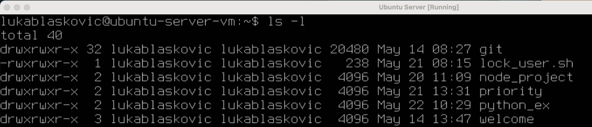
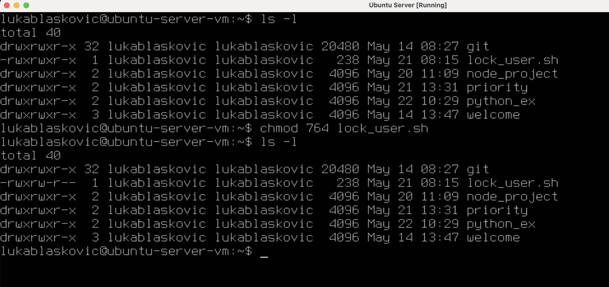

# Operacijski sustavi (OS)

**Nositelj**: doc. dr. sc. Ivan Lorencin
**Asistent**: Luka Blašković, mag. inf.

**Ustanova**: Sveučilište Jurja Dobrile u Puli, Fakultet informatike u Puli

</img>

# (5) Rad na Virtualnom stroju: Naprednije teme

</img>

<div style="float: clear; margin-right:5px;">
Procesi predstavljaju aktivne instance programa koji se izvršavaju unutar operacijskog sustava. U višezadaćnim operacijskim sustavima, što uključuje sve suvremene računalne sustave, procesor se brzo prebacuje između više procesa, omogućujući tako istovremeno i konkurentno izvođenje različitih programa.
Operacijski sustav ima ključnu ulogu u organizaciji i optimizaciji rada sustava – on upravlja dostupnim resursima te raspodjeljuje procesorsko vrijeme među različitim procesima i njihovim dretvama. U ovoj skripti pružit ćemo uvod u upravljanje procesima i dretvama, te upoznati osnovne alate koji se koriste za njihovo praćenje i kontrolu u Linux operacijskom sustavu.
Osim toga, obradit ćemo i upravljanje korisnicima, korisničkim grupama i servisima – pozadinskim procesima koji se automatski pokreću prilikom dizanja sustava i omogućuju kontinuiran rad ključnih funkcionalnosti operacijskog sustava.

</div>

<div style="float: clear; margin-right:5px;"> </div>
<br>

**🆙 Posljednje ažurirano: 22.5.2025.**

## Sadržaj

- [Operacijski sustavi (OS)](#operacijski-sustavi-os)
- [(5) Rad na Virtualnom stroju: Naprednije teme](#5-rad-na-virtualnom-stroju-naprednije-teme)
  - [Sadržaj](#sadržaj)
- [1. Upravljanje procesima](#1-upravljanje-procesima)
  - [1.1 Interaktivni pregled procesa (`top`/`htop`)](#11-interaktivni-pregled-procesa-tophtop)
      - [Alat `top`](#alat-top)
      - [Alat `htop`](#alat-htop)
  - [Zadatak 1: Tumačenje procesa](#zadatak-1-tumačenje-procesa)
  - [1.2 Programske dretve](#12-programske-dretve)
      - [Alat `kill`](#alat-kill)
      - [Alati `pidof` i `pgrep`](#alati-pidof-i-pgrep)
      - [Alat `pkill`](#alat-pkill)
  - [1.3 Alat `nice`](#13-alat-nice)
  - [Zadatak 2: Upravljanje procesima](#zadatak-2-upravljanje-procesima)
- [2. Upravljanje korisnicima i grupama](#2-upravljanje-korisnicima-i-grupama)
  - [2.1 Naredba `useradd`](#21-naredba-useradd)
  - [2.2. Tablica čestih zastavica naredbe `useradd`](#22-tablica-čestih-zastavica-naredbe-useradd)
  - [2.3 Naredba `usermod`](#23-naredba-usermod)
  - [2.4. Tablica čestih zastavica naredbe `usermod`](#24-tablica-čestih-zastavica-naredbe-usermod)
  - [2.5 Naredba `userdel`](#25-naredba-userdel)
  - [Zadatak 3: Upravljanje korisnicima i grupama](#zadatak-3-upravljanje-korisnicima-i-grupama)
- [3. Dozvole datoteka (eng. file permissions)](#3-dozvole-datoteka-eng-file-permissions)
      - [Alat `chown`](#alat-chown)
  - [Zadatak 4: Dozvole datoteka](#zadatak-4-dozvole-datoteka)
- [4. Upravljanje servisima](#4-upravljanje-servisima)
  - [Zadatak 5: Upravljanje servisima](#zadatak-5-upravljanje-servisima)
- [Zadaci za Vježbu 5](#zadaci-za-vježbu-5)

<div style="page-break-after: always; break-after: page;"></div>

# 1. Upravljanje procesima

Puno puta smo čuli pojam proces, no što je to zapravo? Najjednostavnije rečeno, **proces** je instanca programa koja se izvršava.

Pojam **računalnog programa** možemo vrlo slično definirati - kao skup instrukcija koje se izvršavaju u određenom redoslijedu, a tipično se nalaze pohranjene na disku. Jednom kad se program pokrene, te instrukcije se učitavaju u radnu memoriju i izvršavaju. U tom trenutku, program postaje proces. Međutim, često je slučaj da se više procesa pokreće istovremeno, odnosno da se **više procesa asocira s istim programom**.

Osim samog programa, proces sadrži (enkapsulira) i sve druge resurse potrebne za njegovo izvršavanje, kao što su:

- **adresni prostor** (eng. <i>address space</i>) - dio memorije koji proces koristi
- **skup otvorenih datoteka** (eng. <i>open files</i>) - datoteke koje proces koristi
- **deskriptori procesa** (eng. <i>process descriptors</i>) - informacije o procesu, kao što su PID (eng. <i>process ID</i>), UID (eng. <i>user ID</i>), GID (eng. <i>group ID</i>) i drugi atributi
- **varijable okoline** (eng. <i>environment variables</i>) - varijable koje proces koristi
- **informacije o procesoru** (eng. <i>CPU</i>) - trenutno stanje procesora (registri, brojač instrukcija, itd.) ako je proces u stanju izvođenja

</img>

> 🖼️ Računalni program je skup instrukcija pohranjen na disku, dok proces predstavlja egzekuciju (realizaciju) tog programa. Naravno, za realizaciju je potrebno više od samih instrukcija (programskog koda)

**Višezadaćnost** (eng. <i>multitasking</i>) je metoda koja dozvoljava izvođenje više procesa istovremeno - konkurentno (_eng. concurrent_). U višezadaćnom operacijskom sustavu, novi procesi mogu biti stvoreni i izvršavati se paralelno s postojećim procesima.

Svaka jezgra procesora (_eng. CPU core_) može izvršavati samo jedan proces u jednom trenutku. Međutim, višezadaćnost dozvoljava procesoru da se **brzo prebacuje (_eng. switch_) između različitih procesa bez čekanja da jedan proces završi**.

Mehanizam kojim se ostvaruje ovo prebacivanje između procesa naziva se _context switching_. Termin se koristi i u psihologiji, gdje se, baš kao i u računalstvu, koristi za opisivanje prebacivanja između različitih zadataka, projekata ili aktivnosti. Premda prema nekim istraživanjima, "biološki" _context switching_ [često dovodi do smanjenja produktivnosti](https://asana.com/resources/context-switching), što definitivno nije slučaj u računalstvu.

Glavna zadaća OS-a za vrijeme višezadaćnosti je učinkovito upravljanje resursima i raspodjela vremena procesora između različitih procesa.

## 1.1 Interaktivni pregled procesa (`top`/`htop`)

Podignut ćemo naš virtualni stroj i Ubuntu Server. Kako bi provjerili sve procese koji se trenutno izvršavaju, možemo koristiti naredbu `ps aux`.

```bash
→ ps aux
```

Dobit ćemo detaljni tablični prikaz svih aktivnih procesa, možemo rezultat proslijediti i kroz naredbu `less` kako bi mogli _proscrollati_:

```bash
→ ps aux | less
```

Međutim, rekli smo da u višezadaćnom operacijskom sustavu procesor vrlo često prebacuje (skače) između različitih procesa. Samim time, procesi se mogu nalaziti u različitim stanjima. Naredba `ps` ne daje nam mogućnost da pratimo promjene stanja procesa, već daje **_snapshot_ procesa u trenutku kada je naredba izvršena**.

#### Alat `top`

Kako bi pratili promjene stanja procesa, možemo koristiti ugrađeni alat `top`.

`top` pruža pregled svih aktivnih procesa i njihovih resursa u stvarnom vremenu.

```bash
→ top
```

</img>

> 🖼 Rezultat naredbe `top` je interaktivni prozor koji prikazuje dinamičku listu procesa u realnom vremenu

Na vrhu prozora možemo vidjeti nekoliko informacija o sustavu, uključujući:

- `Tasks` - ukupan broj procesa (_taskova_) i podjela prema stanju

- `%Cpu(s)` - utilizacija procesora podijeljena po više kategorija

- `MiB Mem` - ukupna i slobodna radna memorija u mebibajtovima (_MiB_), gdje je 1 MiB = 2^20 (1.048.576) bajtova.

- `MiB Swap` - ukupna i slobodna _swap_ memorija u mebibajtovima (_MiB_)

> **💡Napomena:** MebiByte nije isto što i Megabyte.
> `1 MB = 1,000,000 bajtova (B) = 1000 × 1000 B`,
> `1 MiB = 1,048,576 B = 1024 × 1024 B`.
> Iako su obje jedinice vrlo slične i često se koriste naizmjenično u svakodnevnoj komunikaciji, postoji jasna tehnička razlika između njih. Megabyte (MB) koristi decimalni sustav (baza 10), dok Mebibyte (MiB) koristi binarni sustav (baza 2).
> Mebibyte (MiB) i slične binarne jedinice (Kibibyte _KiB_, Gibibyte _GiB_, itd.) definirala je Međunarodna elektrotehnička komisija (IEC) još 1998. godine kako bi se izbjegla zabuna. Ove jedinice se češće koriste u Linux operativnim sustavima, gdje se preciznije prikazuje stvarna količina memorije. S druge strane, Windows, macOS i proizvođači hardvera uglavnom koriste decimalne jedinice – što nas dovodi do zanimljivog pitanja:
> **Jeste li se ikad pitali zašto dobijete manje memorije nego što ste platili?**
> Primjerice: Kupite 512 GB SSD, ali vam računalo pokazuje oko 475 "GB" slobodne memorije. "GB" je u ovom slučaju namjerno pod navodnim znakovima jer se ustvari radi o 475 GiB (Gibibyte). Razlog tome je što proizvođači hardvera iz marketinških (dakle financijskih) razloga koriste decimalni sustav za prikazivanje kapaciteta, dok operacijski sustavi koriste binarni sustav.
> Na primjer, `1 GiB = 1024 MiB, dok 1 GB = 1000 MB`. Dakle, 512 GB je uistinu oko 476 GiB, i to nije greška, već druga mjerna jedinica!

<hr>

Ako pogledate prikaz procesa, uočite nekoliko važnijih stupaca:

- `PID` - **jedinstveni identifikator procesa** (eng. <i>Process ID</i>)
- `USER` - **korisnik** koji pokreće proces
- `PR` - **prioritet procesa** (eng. <i>Process Priority</i>). **Veći broj znači manji prioritet**.
  - Na primjer, `20` je **manji prioritet** od `10`, a raspon je tipično od `0` do `20`.
  - Vrijednost `0` je **najviši prioritet**, dok je `20` najniži.
  - `PR` se za _user-space_ (normalne) procese računa kao: `PR = 20 + NI`, gdje je `NI` _nice value_ procesa.
- `NI` - **_"nice value"_** - [još jedan "princip" određivanja prioriteta procesa](<https://en.wikipedia.org/wiki/Nice_(Unix)>).
  - Tipično se koristi za određivanje prioriteta procesa koji nisu _real-time_ procesi, a iznosi između `-20` i `19` gdje `-20` predstavlja najviši prioritet, a `19` najniži.
- `VIRT` - ukupna **virtualna memorija** koju proces
- `RES` - **fizička memorija** koju proces koristi
- `SHR` - **dijeljena memorija** koju proces koristi
- `S` - **stanje procesa** (eng. <i>Process State</i>) - više o tome u nastavku
- `%CPU` - **postotak CPU-a** koji proces koristi
- `%MEM` - **postotak RAM-a** koji proces koristi
- `TIME+` - ukupno procesorsko vrijeme koje je proces koristio od pokretanja
- `COMMAND` - **naziv i argumenti naredbe koja je pokrenula proces**

**Određivanje prioriteta procesa** je važno jer OS koristi ovu vrijednost kako bi odredio koji procesi trebaju dobiti više resursa i procesorskog vremena.

**📌Analogija**: Zamislimo računalo kao kuhinju u restoranu, a procese kao narudžbe koje treba pripremiti.

Recimo da su neke narudžbe super hitne (npr. za VIP goste), njih ćemo nazivati **_real-time_ procesima**, dok su ostale narudžbe manje hitne i mogu čekati malo duže (npr. narudžbe za obične, non-VIP goste).

Sljedeća skala ilustrira **prioritetni raspon** (_eng. Priority range_) koji koristi Linux kernel za upravljanje procesima (skala se može razlikovati od distribucije do distribucije, ali generalno je slična):

</img>

> 🖼 Prioritetni raspon koji koristi Linux kernel. Izvor: https://blogs.oracle.com/linux/post/task-priority

> **💡Napomena:** navedena skala predstavlja interni raspon prioriteta koji koristi Linux kernel, a ne korisnički prikaz koji vidimo u alatima poput `top` ili `htop`. Odnosno, ako naš proces ima `PR = 20`, to **ne znači** da je njegov prioritet `20` prema skali i da se radi o _real-time_ procesu!

Uočite podjelu na skali:

- **Real-time** procesi (lijeva strana) imaju visoki prioritet - između `0` i `99`, gdje `0` predstavlja najviši prioritet.

- **Normalni (nice)** procesi (desna strana) imaju niži prioritet - između `100` i `139`, gdje `139` predstavlja najniži prioritet. Ovo su naši obični procesi (ili obični _nice_ gosti kojima se ne žuri). Oni će čekati koliko god treba međutim, neki su malo nestrpljivi i žele da im se narudžba pripremi malo brže!
  - **_nice_** procesi imaju interni prioritet između `-20` i `+19`, gdje `-20` predstavlja goste (_taskove_) koji su nervozni i pomalo škrti po pitanju procesorske snage, dok `+19` predstavlja drage goste koji su strpljivi i spremni su prepustiti procesorsku snagu drugim gostima.

**Linux će uvijek prvo obraditi _real-time_ procese.**

**Za _real-time_ procese, `NI` se ne koristi.**

**Za normalne (tzv. _user-space_) procese**, u pravilu se koristi formula za izračun prioriteta: `PR = 20 + NI`

Dakle:

- proces gdje je `NI = 0` će imati `PR = 20` (tzv. **zadani prioritet**)
- proces gdje je `NI = 10` će imati `PR = 30` (**manji prioritet od zadanog**)
- proces gdje `NI = -20` će imati `PR = 0` (**najveći prioritet među normalnim procesima**)

Uočit ćete da neki procesi imaju `PR < 0`, što najvjerojatnije predstavlja pogrešku u prikazu ili indikaciju da se radi o _real-time_ procesu.

#### Alat `htop`

Moderniji alat koji se može koristiti za praćenje procesa je `htop`, koji je naprednija verzija `top` alata gdje su takve pogreške svedene na minimum. Osim toga, `htop` nudi i više opcija za filtriranje i sortiranje procesa, pristupačnije sučelje i obojeno sučelje, lakše pretraživanje i navigaciju kroz procese itd.

**Sintaksa:**

```bash
→ htop
```

</img>

> 🖼 Moderniji interaktivni prikaz aktivnih procesa koristeći naredbu `htop`.

Ako nije instaliran, možete ga instalirati ručno:

```bash
→ sudo apt install htop
```

Odmah možemo uočiti razliku kod prikaza prioriteta. Prioritet je ovdje prikazan kao `PRI`, a za _real-time_ procese prikazuje se oznaka `RT` (_eng. Real Time_), a ne broj.

Rekli smo da je praktično koristiti `htop` jer pruža i jednostavnije sučelje za **filtriranje**, **sortiranje**, **pretraživanje** procesa itd.

- `F3` - pretraživanje procesa prema naredbi i argumentu (zadano ponašanje), primjer: `Search: python3`
- `F6` - sortiranje procesa prema različitim kriterijima, primjer: `SortBy: CPU%`
- `F4` - sortiranje procesa prema naredbi i argumentu (zadano ponašanje), primjer: `Filter: ModemManager`

</img>

> 🖼️ Primjer filtriranja `python3` procesa u `htop` alatu.

Što se tiče memorije, možemo uočiti 3 glavne kategorije:

1. `VIRT` - **virtualna memorija**
2. `RES` - **fizička memorija**
3. `SHR` - **dijeljena memorija**

**1. Virtualna memorija (VIRT)** predstavlja ukupnu količinu memoriju kojoj proces ima pristup, uključujući i memoriju koja nije fizički prisutna u sustavu. Ova vrijednost je često veća od fizičke memorije (RES) jer uključuje i **_swap_** memoriju, koja se koristi kada fizička memorija (RAM) postane nedovoljna.

- _swap_ predstavlja dio diska koji se koristi kao proširenje fizičke memorije. Zamislite ju kao _backup_ memoriju koju sustav koristi kada ponestaje fizičke memorije.
- _Primjer_: Kada koristimo web preglednik i otvorimo puno kartica, OS može neaktivne kartice "premjestiti" u _swap_ memoriju kako bi oslobodio fizičku memoriju za aktivne kartice.
- Virtualna memorija uključuje i memoriju koju aktivni proces može koristiti, ali nije direktno prisutna u kompajliranom programu, npr. dijeljene biblioteke, konfiguracijske datoteke, druge OS-level datoteke itd.

**2. Fizička memorija (RES)** (_eng. Resident Set Size / Physical Memory_) predstavlja stvarnu količinu radne memorije (RAM) koju proces trenutno koristi. Drugim riječima, predstavlja količinu _non-swapped_ memorije koju proces trenutno okupira u fizičkoj memoriji.

- ova vrijednost direktno utječe na performanse sustava i vrlo je važna metrika za praćenje.
- korespondira stupcu `%MEM` - postotak fizičke memorije koju proces koristi u odnosu na ukupnu fizičku memoriju sustava.

**3. Dijeljena memorija (SHR)** (_eng. Shared Memory_) predstavlja količinu fizičke (`RES`) memorije koju proces dijeli s drugim procesima u sustavu. Ova vrijednost je uvijek manja od fizičke memorije (RES) i može biti korisna za procjenu koliko memorije proces koristi u odnosu na druge procese.

Važan stupac koji nismo objasnili su stanja procesa - `S`.

**Stanje procesa** (_eng. Process State_) predstavlja trenutnu aktivnost procesa i može biti u **jednom od sljedećih stanja**:

- `R` - **Running** - proces se trenutno izvršava: aktivno koristi CPU
- `S` - **Sleeping** proces čeka na neki događaj (npr. I/O operaciju, signal ili semafor)
- `D` - **Uninterruptible Sleep** - proces čeka na I/O operaciju koja se ne može prekinuti (npr. čitanje s diska)
- `T` - **Stopped/Terminated** - proces je zaustavljen (npr. zbog signala - `CTRL+Z`)
- `Z` - **Zombie** - proces je završen, ali ga i dalje možemo pronaći u procesnom prikazu (tablici), npr. zbog neodgovarajuće obrade signala od strane roditeljskog procesa
- `X` - **Dead** - proces je mrtav, potpuno je završen i ne može se više pronaći u procesnom prikazu. Ovu oznaku ćemo vrlo rijetko vidjeti.

</img>

> 🖼️ Graf stanja procesa i prelazaka u drugo stanje. Izvor: https://idea.popcount.org/2012-12-11-linux-process-states/

Ako malo _proscrollamo_ kroz procese, možemo vidjeti da gotovo svi procesi imaju oznaku `S` (sleeping). Ova oznaka označava stanje prekidljivog mirovanja, što ne znači da računalo ne obavlja nikakve aktivnosti. Naprotiv, riječ je o standardnom i učinkovitom mehanizmu upravljanja resursima u Linux operacijskom sustavu, kojim se omogućuje da procesi čekaju događaje bez nepotrebnog opterećenja procesora.

Uočit ćete i jedan aktivan proces (`R`) - a to je upravo naš `htop` alat koji aktivno koristi CPU.

**Vježba**: Sada kada smo usvojili kako pronaći i tumačiti procese, vrijeme je za malo praktične primjene. U nastavku ćemo analizirati nekoliko konkretnih procesa kako bismo bolje razumjeli njihovo ponašanje i ulogu u sustavu:

Proces `htop`

```bash
PID  USER          PRI NI VIRT RES  SHR  S CPU% MEM% TIME+    COMMAND
1041 lukablaskovic 20  0  5512 3712 2944 R 1.3  0.2  0:15.01  htop
```

- PID `1041` - jedinstveni identifikator procesa, pokreće ga korisnik `lukablaskovic`
- Prioritet je `20`, a _nice value_ je `0`. Dakle, radi se o normalnom procesu (ne _real-time_) koji ima **zadani prioritet**.
- Proces koristi ukupno `5512 B` virtualne memorije, od čega `3712 B` fizičke memorije. Veliki dio fizičke memorije je dijeljen s drugim procesima (`2944 B`).
- Proces je trenutno aktivan (`R`), zauzima `1.3%` CPU-a i `0.2%` fizičke memorije. Procesor je koristio ukupno `~15` minuta od pokretanja.
- Naredba koja je pokrenula proces je `htop`.

<hr>

Proces `-bash`

```bash
PID  USER          PRI NI VIRT RES  SHR  S CPU% MEM% TIME+    COMMAND
986  lukablaskovic 20  0  5780 4736 3200 S 0.0  0.2  0:00:04 -bash
```

- PID `986` - jedinstveni identifikator procesa, pokreće ga korisnik `lukablaskovic`
- Prioritet je `20`, a _nice value_ je `0`. Dakle, radi se o normalnom procesu (ne _real-time_) koji ima **zadani prioritet**.
- Proces koristi ukupno `5780 B` virtualne memorije, od čega `4736 B` fizičke memorije. Veliki dio fizičke memorije je dijeljen s drugim procesima (`3200 B`).
- Proces trenutno spava (`S`), ne zauzima CPU, ali koristi `0.2%` fizičke memorije. Procesor je koristio ukupno `~4` sekunde od pokretanja.
- Naredba koja je pokrenula proces je `-bash`.

<hr>

Proces `multipathd`

```bash
PID   USER PRI NI VIRT   RES   SHR  S CPU% MEM% TIME+    COMMAND
340   root RT  0  347M 26240 7296 S 0.0  1.3  0:00:00  /sbin/multipathd -d -s
```

- PID `340` - jedinstveni identifikator procesa, pokreće ga korisnik `root` odnosno [_superkorisnik_](https://en.wikipedia.org/wiki/Superuser)
- Radi se o _real-time_ procesu što je jasno iz oznake `RT`, a `NI` je `0`.
- Proces koristi ukupno `347 MB` virtualne memorije, od čega `26240 B` fizičke memorije (`~0.02 MB`), što indicira da se radi o procesu koji koristi jako puno virtualne memorije, ali vrlo malo fizičke memorije. Manji dio fizičke memorije je dijeljen s drugim procesima (`7296 B`).
- Proces trenutno spava (`S`), ne zauzima CPU, ali koristi `1.3%` fizičke memorije. Procesor je koristio ukupno `~0` sekundi od pokretanja.
- Naredba koja je pokrenula proces je `/sbin/multipathd -d -s`.

<hr>

<div style="page-break-after: always; break-after: page;"></div>

## Zadatak 1: Tumačenje procesa

Otvorite `htop` alat i analizirajte barem:

- 1 _real-time_ proces
- 1 _normalni_ proces koji je pokrenuo korisnik `root`
- 1 _normalni_ proces koji ste vi pokrenuli

Protumačite sve stupce kao što smo to napravili u prethodnim primjerima.

## 1.2 Programske dretve

**Dretva** (_eng. thread_) je **najmanja jedinica izvršavanja** unutar procesa. Više dretvi može postojati unutar istog procesa, a svaka dretva može samostalno izvršavati skup instrukcija. Sve dretve jednog procesa **dijele isti adresni prostor** (memoriju), uključujući varijable, otvorene datoteke i druge resurse. Međutim, svaka dretva ima **vlastiti programski brojač**, **registarski skup** i **vlastiti stog** (_eng. stack_), što joj omogućuje neovisno izvršavanje.

To omogućuje **višezadaćnost unutar jednog procesa** (_tzv. multithreading_), gdje više dretvi može istodobno raditi na različitim zadacima, često s boljom učinkovitošću nego pokretanje više procesa, jer je međusobna komunikacija između dretvi brža i manje zahtjevna.

S druge strane, proces je samostalna instanca programa u izvršavanju, s vlastitim adresnim prostorom i resursima. Dretve unutar istog procesa surađuju na izvršavanju zadataka dijeleći kontekst procesa.

_Primjer:_ Moderni web preglednici koriste **višestruke procese** (_multiprocessing_) i višestruke dretve (_multithreading_) za postizanje bolje stabilnosti i performansi.

- Svaka kartica u pregledniku često se otvara kao zaseban proces, što povećava stabilnost i sigurnost — ako dođe do pada jedne kartice, ostale nisu pogođene.

- Unutar svake kartice (procesa), preglednik koristi više dretvi za paralelno izvršavanje različitih zadataka kao što su:
  - učitavanje i prikaz HTML sadržaja
  - obrada i izvršavanje JavaScript koda
  - mrežne operacije (npr. dohvaćanje resursa)
  - prikazivanje slika i videozapisa
  - upravljanje korisničkim sučeljem

</img>

> 🖼️ Ilustracija prikazuje više dretvi unutar istog procesa, od kojih svaka ima različito trajanje izvršavanja tijekom rada procesa.

Dretveni prikaz koristeći `htop` će najvjerojatnije biti zadan, ako nije, možemo ga pokrenuti zastavicom `-H`:

```bash
→ htop -H
```

Možemo otvoriti `Setup (F2)` i omogućiti opciju `Display options -> Display threads in a different color` kako bi lakše razlikovali dretve od procesa.

</img>

> 🖼 `htop`: `Setup F2` -> `Display options` -> `Display threads in a different color`

Pod `Command` ćete sada uočiti dretve definirane **zelenom bojom**. Dodatno, možemo prikazati hijerarhiju pritiskom na tipku `F5` (_Tree view_).

</img>

> 🖼️ `htop`: Prikaz hijerarhije procesa i dretvi, hijerarhijski odabirom `F5` opcije

Primjerice, za proces `/sbin/multipathd -d -s` možemo vidjeti da se radi o procesu koji koristi 6 dretvi. Dodatno, u ovom slučaju dretve dijele resurse pa možemo vidjeti iste vrijednosti za `VIRT`, `RES` i `SHR` i `MEM%` stupce.

Općenito, unutar `htop` alata možemo u gornjem desnom kutu vidjeti ukupan **broj procesa**, **dretvi** i **skrivenih kernel dretvi**.

- `Tasks` - **ukupan broj procesa**. Na slici iznad je `21`, a taj broj možete dobiti prebrojavanjem procesa u `htop` alatu koji su označeni bijelom bojom.

**Uočite sljedeće:** Kod procesa `/bin/login -p` nemamo dretve, već potprocese `-bash` i `htop -H`. Ovakva hijerarhija se može dogoditi kada proces pokrene drugi proces, `bash` i `htop` su potprocesi koji su pokrenuti iz procesa `/bin/login -p`, a ne dretve.

- `threads (thr)` - označeno zelenom bojom, predstavlja **ukupan broj dretvi** koje različiti procesi koriste. Na slici iznad je `27`, a taj broj možete dobiti prebrojavanjem dretvi u `htop` alatu koje su označene zelenom bojom.

- `hidden kernel threads` - označeno sivom bojom, predstavlja **ukupan broj skrivenih kernel dretvi**. Na slici iznad je `74`. Ne možemo ih prebrojati jer su skrivene, ali ih možemo prikazati tako što otvorimo `Setup (F2)` i onemogućimo opciju `Display options -> Hide kernel threads`.

Kada omogućimo skrivene kernel dretve, možemo ih vidjeti u `htop` alatu označene isto zelenom bojom.

</img>

> 🖼️ `htop`: Prikaz skrivenih kernel dretvi - označene isto tako zelenom bojom

#### Alat `kill`

Kako bismo prekinuli neki proces (ili dretvu), možemo koristiti alat `kill`. Ova naredba šalje određeni signal procesu kako bi ga prekinula ili promijenila njegovo stanje.

Naredba `kill` koristi se za slanje signala procesu putem njegovog PID-a, i ne mora se raditi o prekidu procesa, već i o drugim signalima koji mogu promijeniti njegovo ponašanje. Međutim, najčešće se koristi za prekid procesa interuptivnim signalom koji prebacuje stanje procesa iz `R` (Running) u `T` (stopped).

**Sintaksa:**

```bash
→ kill [opcije/zastavice] <PID>
```

Opcije (zastavice) predstavljaju vrstu signala koji šaljemo procesu. Najčešće korišteni signali su:

- `-9` - **SIGKILL** - prisilno prekida proces, ne može se obraditi
- `-15` - **SIGTERM** - šalje procesu zahtjev za prekidom, proces može obraditi signal i završiti se na "ljubazan" način
- `-1` - **SIGHUP** - šalje procesu signal za ponovno učitavanje konfiguracije, često se koristi za ponovno učitavanje usluga
- `-2` - **SIGINT** - šalje procesu signal za prekid, obično se koristi kada pritisnemo `CTRL+C` u terminalu
- `-19` - **SIGSTOP** - šalje procesu signal za pauziranje, proces se ne može obraditi i ne može se nastaviti dok ga ne prekinemo
- `-18` - **SIGCONT** - šalje procesu signal za nastavak nakon pauziranja

Prema zadanim postavkama, `kill` šalje signal `SIGTERM` (`-15`) procesu.

Otvorite `htop` i pronađite `PID` procesa `htop`. Možete i pretraživati (`F3`) kako biste ga lakše pronašli.

</img>

> 🖼️ `htop`: Pronalazak procesa pretraživanjem po nazivu (`F3`)

Vidimo da je `PID` našeg `htop` procesa `1421`. Dakle, prekinuli bismo ga koristeći:

```bash
→ kill 1421

# ili agresivno

→ kill -9 1421
```

Problem: `htop` proces zauzima terminal sučelje i ne možemo upisivati druge bash naredbe.

Možemo se spojiti sa SSH klijentom na naš virtualni stroj i pozvati naredbu u novoj sesiji, ili pak možemo pokretati novu sesiju pritiskom `ALT + →` ili `ALT + ←` i na taj način otvoriti novu **Virtualnu konzolu** (`TTY`):

Trebali biste vidjeti nove sesije koje razlikujete po oznaci `tty[N]`, npr. `tty1`, `tty2`, `tty3` itd. `tty` je stara oznaka za terminal sučelje, a `N` predstavlja broj terminala.

</img>

> 🖼️ Nova terminal sesija (`tty3`) u koju smo se prebacili pritiskom na `ALT + →`

Prijavite se i pokrenite naredbu za prekidanje procesa `htop`:

```bash
→ kill 1421
```

Prebacite se natrag u prethodnu sesiju, vidjet ćete da je `htop` proces prestao raditi - terminiran je.

<hr>

#### Alati `pidof` i `pgrep`

`PID` procesa, osim pretraživanjem unutar `htop` alata, možemo pronaći i pomoću naredbi `pidof` ili `pgrep`:

- Ako proces nije pokrenut ili je unesen netočan naziv, naredba `pidof` neće prikazati nikakav izlaz/output
- možemo se i uvjeriti ispisom statusa posljednje naredbe (`$?`)

```bash
→ pidof htop # ispisuje PID procesa "htop" ako je pokrenut

→ echo $? # ispisuje 0 ako je proces pokrenut i postoji PID, inače ispisuje 1
```

Vrlo često nećemo znati točan naziv procesa pa je praktično koristiti i pretraživanje po najbližem podudaranju - koristeći alat `pgrep` baziran na `grep`-u:

Recimo, `htop` možemo pretraživati kao `ht` ili `hto`:

```bash
→ pgrep hto # ispisuje PID procesa "htop" ako je pokrenut
→ echo $? # ispisuje 0 ako je proces pokrenut i postoji PID, inače ispisuje 1

→ pgrep Modem # ispisuje PID procesa "ModemManager" ako je pokrenut
→ pidof Modem # Neće ispisati ništa jer je puni naziv naredbe koja pokreće proces "ModemManager"
```

#### Alat `pkill`

Postoji skraćena verzija `kill` naredbe koja se koristi za zaustavljanje procesa prema nazivu, a ne prema `PID`-u. Ova naredba se zove `pkill` i na neki način je kombinacija naredbi `pgrep` i `kill`.

**Sintaksa:**

```bash
→ pkill [opcije/zastavice] <ime_procesa>
```

Na primjer, ako želimo prekinuti sve procese koji se zovu `htop`, možemo koristiti:

```bash
→ pkill htop
```

Postoji i varijanta - `killall` koja se koristi za prekid svih procesa koji imaju isto ime, bez obzira na korisnika koji ih pokreće. Primjerice, želimo odjednom zatvoriti `chrome` ili `firefox` i sve njihove procese:

```bash
→ killall chrome
→ killall firefox
```

Ova naredba će neizravno prekinuti i sve dretve koje su pokrenute unutar tih procesa, budući da su dio tog procesa.

## 1.3 Alat `nice`

Alat `nice` se koristi za pokretanje procesa s definiranim `NI` prioritetom. Ova naredba omogućava korisnicima da odrede prioritet procesa koji pokreću, čime se može utjecati na raspodjelu resursa i CPU vremena između različitih procesa.

Rekli smo da je `NI` prioritet procesa između `-20` i `19`, gdje `-20` predstavlja najviši prioritet, a `19` najniži.

**Sintaksa:**

```bash
→ nice -n <prioritet> <naredba>
```

- `<prioritet>` - predstavlja prioritet koji želimo postaviti procesu, a može biti između `-20` i `19`
- `<naredba>` - predstavlja naredbu koju želimo pokrenuti s određenim prioritetom (može biti bilo koja CLI naredba, uključujući i bash izraz ili skripta)

Primjer: Ako definiramo bash skriptu `numbers.sh` koja ispisuje brojeve od `1` do `100`, možemo ju pokrenuti s različitim prioritetima:

```bash
→ nano numbers.sh
```

```bash
#!/bin/bash

for i in {1..100}
do
  echo $i
done
```

Dodjeljujemo dozvolu za izvršavanje `x`:

```bash
→ chmod +x numbers.sh
```

Skriptu možemo pokrenuti s različitim prioritetima:

```bash
→ nice -n 0 ./numbers.sh # pokreće skriptu s prioritetom 0 (zadani prioritet)

→ nice -n 10 ./numbers.sh # pokreće skriptu s prioritetom 10 (manji prioritet od zadanog)

→ sudo nice -n -10 ./numbers.sh # pokreće skriptu s prioritetom -10 (veći prioritet od zadanog)
```

Ponekad je za pokretanje naredbi s većim prioritetom potreban `sudo` pristup. Ako pokušamo pokrenuti skriptu s višim prioritetom bez `sudo` naredbe, dobit ćemo poruku:

```bash
nice: cannot set niceness: Permission denied
```

Skripta radi, međutim ako se paralelno u drugom terminalu prebacimo u `htop`, nećemo vidjeti naš proces jer se prebrzo izvrši i proces tu nestaje.

Naredbom `sleep` ćemo usporiti ispisivanje brojeva, nakon svakog ispisa ćemo čekati `1` sekundu:

```bash
#!/bin/bash

for i in {1..100}
do
  echo $i
  sleep 1
done
```

Ako jednostavno pokrenemo skriptu, ona će se ustvari pokrenuti sa zadanim prioritetom, odnosno:

- `NI = 0`
- `PRI = 20`

```bash
→ ./numbers.sh
```

Pokrenimo `htop` i pogledajmo kako se proces ponaša:

Uočite sljedeću hijerarhiju procesa/potprocesa:

- `/bin/login -p --` - proces koji se pokreće na početku (login sesija)
  - `-bash` - potproces koji pokreće `bash` shell
    - `/bin/bash .numbers.sh` - potproces koji pokreće našu bash skriptu
      - `sleep 1` - potproces koji pokreće `sleep` naredbu

Ako pokrenemo skriptu s `nice` naredbom, primijetite da se procesi nalaze u drugoj hijerarhiji:

```bash
→ nice -n 10 ./numbers.sh # pokreće skriptu s prioritetom 10 (manji prioritet od zadanog)

→ sudo nice -n -20 ./numbers.sh # pokreće skriptu s prioritetom -20 (najviši prioritet)
```

</img>

> 🖼️ `htop` prikaz: Proces instanciran naredbom `nice` s najvišim mogućim prioritetom od `-20`.

Ako želimo promijeniti prioritet već pokrenut procesa (u fazi `R`), možemo koristiti `renice` varijantu naredbe:

**Sintaksa:**

```bash
→ renice -n <prioritet> -p <PID>
```

Na primjer, ako želimo povećati prioritet izvođenja procesa `./numbers.sh`, možemo prvo pronaći njegov `PID` koristeći `htop` ili `pidof` ili `pgrep`:

```bash
→ pgrep numbers # vraća PID pokrenutog procesa
```

> **💡Napomena** : puni naziv procesa je: `/bin/bash ./numbers.sh` zbog _shebang_ oznake na početku skripte

Smanjit ćemo mu prioritet na `-10`:

```bash
→ sudo renice -n -10 -p <PID>

# Primjer:
→ sudo renice -n -10 -p 2351
```

Otvorite alat `htop` i provjerite je li se prioritet izvođenja procesa promijenio.

<hr>

Općenito, sve skripte (bile one `bash`, `python`, `node` ili druge), možemo pozivati i u pozadini (_eng. background execution_) koristeći oznaku `&` nakon poziva:

**Sintaksa:**

```bash
→ <naredba> &
# Primjeri:
→ ./numbers.sh &
→ nice -n 10 ./numbers.sh &
→ node hello.js &
→ python3 hello.py &
```

Na ovaj način, **skripta će se izvoditi u aktivnoj terminal sesiji, ali neće zauzeti terminal sučelje** i moći ćemo nastaviti raditi u istoj sesiji.

## Zadatak 2: Upravljanje procesima

Alat `node` omogućuje pokretanje JavaScript koda izvan okruženja web preglednika. Možete ga jednostavno instalirati u Ubuntu Server koristeći `apt` alat. Jednom kada ga instalirate, u _home_ direktoriju stvorite novu datoteku `stopwatch.js` koja će sadržavati jednostavnu skriptu koja će čekati određeno vrijeme i zatim ispisati poruku.

U JavaScriptu, _timer_ možete implementirati koristeći `setTimeout` funkciju koja prima _callback_ funkciju (ono što se poziva jednom kad vrijeme istekne) i vrijeme u milisekundama (koliko se čeka):

```javascript
setTimeout(callback_fn, vrijeme_ms);
```

Odredite proizvoljno vrijeme čekanja (npr. `5000` ms) i ispišite poruku nakon isteka vremena.

Jednom kad napišite skriptu, možete ju pokrenuti koristeći naredbu `node`. Provjerite kako se proces ponaša koristeći `htop` alat. Ispišite PID procesa i provjerite njegovu hijerarhiju.

Nakon toga, pokrenite ponovo skriptu koristeći `nice` naredbu sa:

- zadanim prioritetom
- prioritetom `-10`
- prioritetom `10`

`node` omogućuje pristup procesnim informacijama putem `process` objekta u JS kodu. Na primjer, možete ispisati PID trenutnog procesa koristeći:

```javascript
console.log(process.pid);
```

Ispišite PID trenutnog procesa jednom kad on započne, zatim pomoću `htop` alata provjerite podudara li se.

<div style="page-break-after: always; break-after: page;"></div>

# 2. Upravljanje korisnicima i grupama

Upravljanje korisnicima i grupama (_eng. User and Group Management_) još je jedan ključan aspekt administracije Linux sustava, koji je, srećom, znatno jednostavniji od upravljanja procesima.

Cijela priča svodi se na svega nekoliko osnovnih naredbi koje možemo koristiti za dodavanja, uklanjanje i upravljanje korisnicima/grupama.

Prije nego što krenemo manipulacijama korisnika, nije loše provjeriti aktivne sesije i aktivnog (prijavljenog) korisnika, naredbama `who` odnosno `whoami`:

```bash
→ who # ispisuje sve aktivne korisnike i njihove terminal sesije (TTY1, TTY2, TTY3, itd.)
→ whoami # ispisuje trenutnog korisnika koji je prijavljen
```

Kako bismo zatvorili one prethodne sesije, možemo izaći pomoću `exit` ili `CTRL + D`.

Kako bismo provjerili **sve pohranjene korisnike**, možemo pročitati sadržaj datoteke `/etc/passwd`:

```bash
→ cat /etc/passwd
```

</img>

> 🖼️ Prikaz svih korisnika u konfiguracijskoj datoteci `/etc/passwd`

Ova datoteka sadrži sve korisnike koji su registrirani, svaki redak predstavlja jednog korisnika.

Svaki zapis je u formatu:

```bash
username:x:UID:GID:comment:home_directory:shell
```

- `username` - korisničko ime
- `x` - oznaka za lozinku (nekad je ovdje bila pohranjena lozinka, sada je pohranjena u konf. datoteci: `/etc/shadow`)
- `UID` - jedinstveni identifikator korisnika (User ID)
- `GID` - jedinstveni identifikator grupe (Group ID)
- `comment` - opis korisnika (npr. može biti puno ime i prezime)
- `home_directory` - putanja do korisničkog direktorija (npr. `/home/lukablaskovic`)
- `shell` - zadani shell koji se koristi prilikom prijave (npr. `/bin/bash`)

Vidjet ćete veliki broj korisnika, uz vašeg koji se nalazi pri dnu. Radi se o sustavnim korisnicima (eng. system users) koji su potrebni za rad sustava i raznih servisa.

Na vrhu ćete vidjeti `root` korisnika koji je **superkorisnik i ima sve privilegije u sustavu**.

Kako bismo se prebacili u `root` korisnika, možemo koristiti naredbu:

```bash
→ sudo -i
```

</img>

> 🖼️ Prebacivanje u `root` korisnika koristeći `sudo -i` naredbu

Kada smo u `root` korisniku, možemo koristiti sve privilegije i upravljati sustavom bez ograničenja - **ne moramo koristiti `sudo` ispred svake naredbe**.

Kako bismo se prebacili natrag u našeg korisnika, možemo koristiti naredbu `su`:

**Sintaksa:**

```bash
→ sudo su - <username>
```

- gdje je `<username>` korisničko ime korisnika u kojeg se prebacujemo

Na ovaj način se možemo prebaciti i u `root` korisnika:

```bash
→ sudo su - root # isto što i sudo -i
```

## 2.1 Naredba `useradd`

Naredba `useradd` služi za kreiranje novih korisničkih računa u sustavu. Za njezino izvođenje potrebne su administratorske ovlasti (privilegije _superusera_ ili pristup putem korisnika `root`).

Prilikom dodavanja korisnika, sustav automatski ažurira ključne **konfiguracijske datoteke**:

- /`etc/passwd` (sadrži osnovne informacije o korisnicima: korisničko ime, UID, GID, home direktorij, zadani shell, itd.)
- `/etc/shadow` (sadrži _hashirane_ lozinke i informacije o isteku lozinki, ako postoje)
- `/etc/group` (sadrži informacije o grupama i članovima grupa)
- `/etc/gshadow` (sadrži _hashirane_ lozinke za grupe i informacije o članovima grupa)

> **💡Napomena**: Upravljanje korisnicima je teoretski moguće izvoditi i direktnom izmjenom ovih konfiguracijskih datoteka, međutim to nije preporučljivo jer je lako napraviti pogrešku

**Sintaksa:**

```bash
→ useradd [opcije/zastavice] <username>
```

- `<username>` - korisničko ime korisnika kojeg dodajemo

_Primjer:_ Dodajemo novog korisnika `markomaric`:

```bash
→ sudo useradd markomaric
```

Prema zadanim postavkama, novi korisnik će biti bez lozinke, a njegov home direktorij će biti `/home/markomaric`. Također, zadani shell će biti `/bin/bash`. Isto možemo provjeriti u datoteci `/etc/passwd`:

```bash
sudo cat /etc/passwd
```

> **💡Hint**: Općenito, kada čitamo velike datoteke nije loše preusmjeriti njihov _output_ u naredbu `grep`. Naredba `grep` (_global regular expression print_) je utility alat koji se koristi za pretraživanje _plaintext_ sadržaja pomoću nekog regularnog izraza (_eng. regular expression_).

**Preusmjeravanje** (_eng. piping_) izvodimo pomoću znaka `|` (pipe). Zapamti kao okomitu cijev.

**Sintaksa:**

```bash
→ naredba | naredba_2 | naredba_3
```

Na primjer, ako želimo brzo pronaći korisnika `markomaric` u datoteci `/etc/passwd`, možemo koristiti:

```bash
→ cat /etc/passwd | grep markomaric # preusmjeri rezultat naredbe cat u naredbu grep (koja ga obrađuje)
```

</img>

> 🖼️ Preusmjeravanje ukupnog sadržaja iz datoteke `/etc/passwd` u `grep` alat koji filtrira sadržaj prema regularnom izrazu, konkretno izraz je običan string: `markomaric`

Ipak, naredba `useradd` neće automatski stvoriti _home_ direktorij za novog korisnika, već to moramo učiniti sami. Prebacit ćemo se u korisnika `markomaric` i pokušati mu stvoriti _home_ direktorij:

```bash
→ sudo su - markomaric # prebacujemo se u novog korisnika
→ whoami # markomaric
→ mkdir /home/markomaric # stvaramo home direktorij
```

Međutim dobit ćemo upozorenje da korisnik nema _home_ direktorij:

```bash
su: warning: cannot change directory to /home/markomaric: No such file or directory
```

Upišite `exit` kako biste se odjavili i vratili u prethodnog korisnika.

Stvorit ćemo _home_ direktorij ručno:

```bash
→ whoami # lukablaskovic
→ sudo mkdir /home/markomaric
→ sudo su - markomaric # prebacujemo se u novog korisnika
```

Ipak, ako pokušate išta raditi s novim korisnikom, nećete moći jer `markomaric` nema privilegije.

**Ne preporučuje se ovo raditi!** Ne želimo nikad ručno stvarati _home_ direktorij, već koristiti odgovarajuću zastavicu/zastavice prilikom pozivanja `useradd` naredbe.

Pogledat ćemo nekoliko korisnih zastavica kako bismo inicijalno korisniku podesili postavke, poput _home_ direktorija, grupa, zadanog shella, itd. prilikom stvaranja korisnika.

## 2.2. Tablica čestih zastavica naredbe `useradd`

| `useradd` zastavica | Opis zastavice                                                                                         | Primjer                                      |
| ------------------- | ------------------------------------------------------------------------------------------------------ | -------------------------------------------- |
| `-m`                | Stvara korisnički _home_ direktorij (`/home/ime`)                                                      | `useradd -m anaanic`                         |
| `-d DIR`            | Postavlja _custom home_ direktorij na `DIR`, ako nije navedeno postavlja se na zadani `/home/korisnik` | `useradd -m -d /opt/anaanic anaanic`         |
| `-s SHELL`          | Postavlja korisniku zadani shell (`SHELL`)                                                             | `useradd -m -s /bin/bash anaanic`            |
| `-u UID`            | Postavlja korisnički ID (`UID`)                                                                        | `useradd -m -u 1050 anaanic`                 |
| `-g GROUP_NAME`     | Postavlja **primarnu grupu korisnika** na `GROUP_NAME`, ako grupa postoji. U nastavku više o grupama.  | `useradd -m -g developeri anaanic`           |
| `-G GROUP1,GROUP2`  | Postavlja **dodatne (sekundarne) grupe** korisnika na `GROUP1` i `GROUP2`                              | `useradd -m -G administrator,gameri anaanic` |
| `-c COMMENT`        | Dodaje komentar (npr. puno ime i prezime)                                                              | `useradd -m -c "Ana Anić" anaanic`           |

Lozinku se ne preporučuje dodavati pomoću zastavice, već **naknadno pomoću** zasebne naredbe `passwd`:

```bash
→ sudo useradd -m -s /bin/bash -c "Ana Anić" anaanic # dodajemo korisnika "anaanic" s home direktorijem i zadanim shellom i punim imenom i prezimenom
→ sudo passwd anaanic # dodajemo lozinku korisniku "anaanic"
```

</img>

> 🖼️ Dodavanje lozinke korisniku `anaanic` koristeći `passwd` nakon uspješnog stvaranja korisnika naredbom `useradd -m -s`

- stvorili smo home direktorij `/home/anaanic`
- postavili smo zadani shell `/bin/bash`
- dodali smo komentar `"Ana Anić"`
- dodali smo lozinku korisniku `anaanic`, **naknadno**

Ako ostanemo u našem korisniku i pokušamo se prebaciti u home direktorij od `anaanic`, dobit ćemo grešku:

```bash
→ whoami # lukablaskovic
→ cd /home/anaanic
bash: cd: /home/anaanic: Permission denied
```

Neće raditi niti sa `sudo`, a niti nije moguće koristiti `sudo` s naredbom `cd`.

Dakle, nemamo privilegije za pristup _home_ direktoriju `anaanic`, **jer je ona vlasnik tog direktorija**. Ipak, možemo ući unutra na dva načina:

- prijavimo se kao `anaanic` korisnik (`su - anaanic`)
- prijavimo se kao `root` korisnik (`sudo -i`) koji ima sve privilegije svijeta

Ako se prijavimo kao `anaanic`, automatski će nas prebaciti u `/home/anaanic`, međutim sad se ne možemo prebaciti u `/home/lukablaskovic` `/home/vaš_username`, niti se možemo prebaciti u `root` korisnika, čak i unosom točne lozinke - **jer nemamo sudo privilegije**.

```bash
→ whoami # anaanic
→ cd /home/lukablaskovic # Permission denied
→ sudo -i # Čak nakon unosa točne lozinke: anaanic is not in the sudoers file.
```

Možemo se odjaviti naredbom `exit`.

## 2.3 Naredba `usermod`

Do sad smo naučili da na Linuxu možemo imati više korisnika, od kojih su neki regularni korisnici, a neki su sustavni korisnici. Također, naučili smo da postoji i _superkorisnik_ `root` koji ima sve privilegije.

**Grupe** predstavljaju **skupine korisnika koji dijele iste privilegije**, preciznije: skupine korisnika koji imaju pristup istim resursima/datotekama u sustavu.

Možemo provjeriti koje grupe sadrži naš korisnik unosom naredbe `groups`:

```bash
→ whoami # lukablaskovic
→ groups # ispisuje sve grupe u kojima je korisnik član
# Ispisuje: lukablaskovic adm cdrom sudo dip plugdev lxd
```

Svaki korisnik može biti član:

- **jedne primarne groupe** (eng. primary group) i
- **jedne ili više dodatnih grupa** (eng. secondary groups).

Uočite da je naš korisnik član grupe `sudo`, što znači da može koristiti `sudo` privilegije - ima administratorske privilegije.

Provjerimo i za korisnika `anaanic`:

```bash
→ groups anaanic # ispisuje sve grupe u kojima je korisnik član
# Ispisuje: anaanic anaanic
```

`anaanic` korisnik je član samo svoje grupe `anaanic`, odnosno nije član nijedne druge dijeljene grupe.

Još jedna praktična naredba za provjeru grupa je naredba `id`.

Naredba `id` ispisuje informacije o korisniku, uključujući njegov **UID** (_User ID_) i **GID** (_Group ID_) za **svaku grupu kojoj pripada**.

```bash
→ whoami # lukablaskovic
→ id
# Ispisuje: uid=1000(lukablaskovic) gid=1000(lukablaskovic) groups=1000(lukablaskovic), 4(adm), 24(cdrom), 27(sudo), 30(dip), 46(plugdev), 101(lxd)
```

**Čitamo:**

- `uid=1000(lukablaskovic)` - _User ID_ korisnika `lukablaskovic` je `1000`
- `gid=1000(lukablaskovic)` - _Group ID_ - primarna grupa korisnika `lukablaskovic` je `1000`
- **ostale** (sekundarne) grupe su: `adm`, `cdrom`, `sudo`, `dip`, `plugdev`, `lxd`, a svaka ima svoj jedinstveni _Group ID_.

> **💡Napomena**: privilegije koje dobivate u grupama možete najjednostavnije pronaći _Googlanjem_. Ove grupe su zadane grupe koje Ubuntu Server postavlja administratorskom korisniku, osim `sudo` prava za egzekuciju naredbi kao `root` korisnik, tu su i:
>
> - `adm` - omogućava pristup log datotekama
> - `plugdev` - omogućava pristup eksternim uređajima, poput USB uređaja
> - `cdrom`, `dip`, `lxd` - omogućavaju pristup raznim uređajima i mrežnim sučeljima

<hr>

Kako bismo korisniku dodali grupu, možemo koristiti naredbu `usermod`:

**Naredba `usermod` se koristi za izmjenu postojećih korisnika u sustavu**, odnosno njihovih postavki, uključujući dodavanje korisnika u grupu. Preciznije, **mi ovom naredbom uređujemo one konfiguracijske datoteke** `/etc/passwd`, `/etc/shadow`, `/etc/group` i `/etc/gshadow`, ovisno koju radnju izvodimo.

**Sintaksa:**

```bash
→ usermod [opcije/zastavice] <username>
```

Cilj je izmijeniti datoteku `/etc/group` i dodati korisnika u grupu. Koristimo sljedeće zastavice:

- `-a` - dodaje korisnika u grupu (append)
- `-G` - definira grupu u koju dodajemo korisnika

Na primjer, ako želimo dodati korisnika `anaanic` u grupu `sudo`, koristimo:

```bash
→ sudo usermod -a -G sudo anaanic
# ili spajanjem zastavica
→ sudo usermod -aG sudo anaanic
```

Provjeravamo grupe korisnika `anaanic`:

```bash
→ groups anaanic # vidimo "sudo" oznaku na kraju
```

Testirat ćemo da li korisnik `anaanic` može koristiti `sudo` privilegije:

```bash
→ su - anaanic # prebacujemo se u korisnika "anaanic"
→ sudo -i # pokušavamo se prebaciti u "root" korisnika
```

Ako je sve prošlo u redu, trebali bismo se prebaciti u `root` korisnika bez problema.

</img>

> 🖼️ Dodavanje `sudo` ovlasti korisniku `anaanic` pomoću naredbe `usermod`, prebacivanje u `root`

> **💡Napomena**: Pazite da ne zaboravite na zastavicu `-a` (append), jer ako ju ne navedemo, lista grupa će biti pregažena i korisnik će biti uklonjen iz svih ostalih grupa, osim iz one koju smo naveli.

Sada smo dodali korisnika u grupu `sudo`, a na isti način možemo i u bilo koju drugu grupu, dok ona postoji.

Novu grupu možemo dodati pomoću naredbe `groupadd`:

**Sintaksa:**

```bash
→ sudo groupadd <groupname>
```

- `<groupname>` - naziv nove grupe koju dodajemo

_Primjer:_

```bash
→ sudo groupadd <groupname>

# Primjer:
→ sudo groupadd developeri # dodajemo grupu developeri u sustav
→ sudo usermod -aG developeri anaanic # dodajemo korisnika anaanic u grupu developeri
```

## 2.4. Tablica čestih zastavica naredbe `usermod`

| `usermod` zastavica | Opis zastavice                                                                                     | Primjer                            |
| ------------------- | -------------------------------------------------------------------------------------------------- | ---------------------------------- |
| `-aG`               | Dodaje korisniku **sekundarne grupe** (mora se koristiti s `-G`)                                   | `usermod -aG sudo john`            |
| `-G`                | Postavlja dodatne (**sekundarne**) grupe ako postoje (zamjenjuje postojeće ako se ne koristi `-a`) | `usermod -G dev,admin john`        |
| `-g`                | Mijenja **primarnu grupu** korisnika, ako grupa postoji.                                           | `usermod -g developers john`       |
| `-d`                | Mijenja _home_ direktorij                                                                          | `usermod -d /newhome/john john`    |
| `-m`                | Premješta sadržaj u novi _home direktorij_ (koristi se s `-d`)                                     | `usermod -d /newhome/john -m john` |
| `-s`                | Mijenja zadani _shell_ korisnika                                                                   | `usermod -s /bin/bash john`        |
| `-l`                | Mijenja korisničko ime                                                                             | `usermod -l <newname> <oldname>`   |
| `-L`                | Zaključava korisnički račun (onemogućuje prijavu)                                                  | `usermod -L john`                  |
| `-U`                | Otključava korisnički račun                                                                        | `usermod -U john`                  |
| `-e`                | Postavlja datum isteka korisničkog računa                                                          | `usermod -e 2025-12-31 john`       |
| `-c`                | Mijenja komentar (obično puno ime korisnika)                                                       | `usermod -c "John Doe" john`       |

<hr>

_Primjer:_ Napisat ćemo bash skriptu koja očekuje jedan argument - korisničko ime, a zatim će zaključati korisnički račun - onemogućit prijavu za tog korisnika.

```bash
→ whoami # lukablaskovic
→ cd /home/lukablaskovic
→ nano lock_user.sh
```

Prvo očekujemo jedan argument:

```bash
#!/bin/bash

if [ $# -ne 1 ]; then
  echo "Pogrešan unos, unesite: $0 <username>" # ispisujemo poruku upozorenja
  exit 1
fi
```

Provjeru postoji li korisnik možemo odraditi kroz naredbu `id`:

Ako korisni postoji, `id` će ispisati njegov `UID` i `GID` za sve grupe, inače će ispisati: "no such user".

Možemo pozvati naredbu s argumentom korisnika, a zatim provjeriti uspješnost (izlazni status) posljednje naredbe s `$?`:

```bash
id $1 # provjeravamo postoji li korisnik
if [ $? -ne 0 ]; then # ako korisnik ne postoji
  echo "Korisnik $1 ne postoji"
  exit 1
fi
```

Inače, ako korisnik postoji, možemo ga zaključati:

```bash
id $1 # provjeravamo postoji li korisnik
if [ $? -ne 0 ]; then # ako korisnik ne postoji
  echo "Korisnik $1 ne postoji"
  exit 1
fi

# zaključavamo korisnika
sudo usermod -L $1 # zaključavamo korisnika
```

Pozivamo skriptu s argumentom korisničkog imena:

```bash
→ chmod +x lock_user.sh
→ ./lock_user.sh anaanic
```

Ako je sve prošlo u redu, korisnik `anaanic` više se ne može prijaviti u sustav. Međutim, i dalje ćemo se moći prebaciti u njega kao `root` ili administrator korisnik. Otvorite novu terminal sesiju i pokušajte se prijaviti kao `anaanic` korisnik, ili pokušajte putem SSH izvana.

<hr>

_Primjer:_ Napravit ćemo grupu studenti i nekoliko studenata:

```bash
→ sudo groupadd studenti
```

Dodajemo nekoliko studenata:

```bash
→ sudo useradd -m -s /bin/bash -c "Luka Blasković" lukablaskovic
→ sudo useradd -m -s /bin/bash -c "Ana Anić" anaanic
→ sudo useradd -m -s /bin/bash -c "Marko Marić" markomaric
```

Dodajemo sve studente u grupu `studenti`:

```bash
→ sudo usermod -aG studenti lukablaskovic
→ sudo usermod -aG studenti anaanic
→ sudo usermod -aG studenti markomaric
```

## 2.5 Naredba `userdel`

Naredba `userdel` se koristi za brisanje korisničkog računa iz sustava. Ova naredba također zahtijeva administratorske privilegije.

**Sintaksa:**

```bash
→ userdel [opcije/zastavice] <username>
```

- `<username>` - korisničko ime korisnika kojeg brišemo

**Zastavice:**
| `userdel` zastavica | Opis zastavice | Primjer |
| ------------------- | ------------------------------------------------------------------------------------------------------ | -------------------------------------------- |
| `-r` | Briše korisnički račun i **njegov _home_ direktorij** | `userdel -r anaanic` |
| `-f` ili `--force` | Brisanje "na silu", čak i **ako je prijavljen ili ima aktivne procese** | `userdel -f anaanic` |

_Primjer:_ Brišemo korisnika `anaanic` i njezin _home_ direktorij:

```bash
→ sudo userdel -r anaanic

→ sudo userdel -f anaanic # brišemo korisnika, čak i ako je prijavljena i izvršava procese
```

## Zadatak 3: Upravljanje korisnicima i grupama

Podignuli ste VM u cloud okruženju i prijavili se kao `root` korisnik. U vašoj organizaciji imate 2 junior developera na praksi i 1 senior developera. Njihova imena su:

- Senior developer: `Crazy8Dev`, puno ime: `Domingo Gonzalez`
- Junor developer 1: `Cap_n_Cook`, puno ime: `Đesi Rozi`
- Junior developer 2: `FlynnWebDev`, puno ime: `Flyn White`

Napravite korisničke račune za svakog od njih i dodijelite im sekundarnu grupu `devs`. Također, senior developeru dodijelite još jednu sekundarnu grupu `seniors` i `sudo` privilegije.

Dodajte lozinke za sve korisnike.
Kako su junior developeri na praksi, postavite datum isteka korisničkog računa na 1. listopada 2025. godine.

E sad, svake godine dobivate nove juniore i neda vam se ponovo raditi sve ispočetka. Prijavite se kao senior i u njegovom _home_ direktoriju stvorite bash skriptu `create_junior.sh <username> <full_name> <password> <date>` koja će automatski dodati juniore u sustav pozivanjem svih odgovarajućih naredbi koje ste ručno upisivali.

<div style="page-break-after: always; break-after: page;"></div>

# 3. Dozvole datoteka (eng. file permissions)

Privilegije i dozvole su važan aspekt sigurnosti sustava. Na Linuxu, svaki korisnik i grupa imaju svoje privilegije i dozvole koje određuju što mogu ili ne mogu raditi u sustavu.

Svaka datoteka ima svoje dozvole definirane za tri vrste korisnika:

- **Vlasnik (oznaka `u`)** (_eng. owner_) - korisnik koji je stvorio datoteku
- **Grupa (oznaka `g`)** (_eng. group_) - ostali korisnici koji su članovi grupe kojoj datoteka pripada
- **Ostali (oznaka `o`)** (_eng. others_) - svi ostali korisnici u sustavu

Rekli smo da svaki korisnik može biti član jedne primarne grupe i više dodatnih grupa. Svaka datoteka također ima svog **vlasnika** i **grupu** kojoj pripada.

Navedene informacije rekli smo da dobivamo pomoću zastavice `-l` naredbe `ls`:

```bash
→ ls -l
```

</img>

> 🖼️ Prikaz datoteka u _home_ direktoriju s pripadajućim dozvolama i vlasnicima

Prisjetimo se:

- prvi stupac prikazuje dozvole (npr. `-rw-r--r--`)
- drugi stupac prikazuje broj čvrstih veza na datoteku (ovo nam je manje važno)
- treći stupac prikazuje **vlasnika** datoteke
- četvrti stupac prikazuje **grupu kojoj datoteka pripada**

Prema zadanim postavkama, kada korisnik stvori datoteku, **on automatski postaje njen vlasnik, a grupa kojoj datoteka pripada je primarna grupa tog korisnika**.

Primjer: ako korisnik `markomaric` stvori datoteku `test.txt`, vlasnik te datoteke će biti `markomaric`, a grupa kojoj datoteka pripada će biti `markomaric`.

Postoji i 3 **vrste dozvola**:

- **Čitanje (oznaka `r`)** (_eng. read_) - dozvola za čitanje datoteke
- **Pisanje (oznaka `w`)** (_eng. write_) - dozvola za pisanje u datoteku
- **Izvršavanje (oznaka `x`)** (_eng. execute_) - dozvola za izvršavanje datoteke

Do sada smo već dodavali dozvolu za izvršavanje datoteke pomoću `chmod` naredbe.

**Dozvola** je tipično prikazana kao niz od `10` odnosno (`1` + `9`) znakova:

Zašto `1 + 9`? Jer prvi znak označava vrstu datoteke, a ostalih `9` znakova označava dozvole za vlasnika, grupu i ostale korisnike.

```
-rwxrw-r--
```

- **prvi znak** označava vrstu datoteke:

  - `-` - obična datoteka
  - `d` - direktorij
  - `l` - simbolička veza (eng. symbolic link)

- **sljedeća tri znaka** označavaju **dozvole vlasnika datoteke**:
  - `r` - dozvola za čitanje
  - `w` - dozvola za pisanje
  - `x` - dozvola za izvršavanje

_U našem primjeru: `rwx`_

- **sljedeća tri znaka** označavaju **dozvole grupe**:
  - `r` - dozvola za čitanje
  - `w` - dozvola za pisanje
  - `x` - dozvola za izvršavanje

_U našem primjeru: `rw-`_

- **posljednja tri znaka** označavaju **dozvole ostalih korisnika**:
  - `r` - dozvola za čitanje
  - `w` - dozvola za pisanje
  - `x` - dozvola za izvršavanje

_U našem primjeru: `r--`_

<hr>

Zaključujemo da:

- **Vlasnik** može čitati, pisati i izvršavati datoteku (`rwx`)
- **Grupa** može čitati i pisati datoteku, ali ne može je izvršavati (`rw-`)
- **Ostali korisnici** mogu samo čitati datoteku (`r--`)

Dozvole je također moguće prikazati i u numeričkom obliku, gdje se svaka dozvola predstavlja određenim brojem:

| Dozvola | Broj |
| ------- | ---- |
| `r`     | 4    |
| `w`     | 2    |
| `x`     | 1    |
| `-`     | 0    |

**Za svaku vrstu korisnika** (vlasnik, grupa, ostali) **zbrajamo dozvole koje su dodijeljene** i dobivamo broj između i 7.

Primjeri: Prikazat ćemo nekoliko dozvola i njihovu zbrojenu numeričku vrijednost.

- Za dozvolu `rwx` zbrajamo: `4 + 2 + 1 = 7`.
- Za dozvolu `rw-` zbrajamo: `4 + 2 + 0 = 6`.
- Za dozvolu `r--` zbrajamo: `4 + 0 + 0 = 4`.
- Za dozvolu `r-x` zbrajamo: `4 + 0 + 1 = 5`.

Vratimo se na naš primjer za dozvolu `-rwxrw-r--`.

**1. korak** - prvo izbacimo prvi znak `-` koji označava vrstu datoteke
**2. korak** - zbrajamo dozvole za vlasnika: `rwx` = `4 + 2 + 1 = 7`
**3. korak** - zbrajamo dozvole za grupu: `rw-` = `4 + 2 + 0 = 6`
**4. korak** - zbrajamo dozvole za ostale: `r--` = `4 + 0 + 0 = 4`
**5. korak** - konačni rezultat je `764` (u našem slučaju).

Na kraju samo **spajamo** dobivene zbrojeve u jedan broj, tj. `764`, a na početku dodajemo oznaku datoteke.

Dakle, dozvola `-rwxrw-r--` u numeričkom obliku je `764`.

Ovakav zapis naziv se **oktalna reprezentacija dozvole** jer je zapis baziran na oktalnom brojevnom sustavu (baza je broj 8), tj. koristimo brojeve u rasponu od 0 do 7.

Odlično, kako bi sada izmijenili dozvole datoteke, koristimo `chmod` naredbu, oktalnu reprezentaciju dozvola i naziv datoteke.

**Sintaksa:**

```bash
→ chmod <oktalna_reprezentacija> <datoteka>

# Primjer:
→ chmod 764 lock_user.sh # dodaje dozvole: -rwxrw-r--
```

</img>

> 🖼️ Prikaz izmijenjene dozvole datoteke `lock_user.sh` na `764` (-rwxrw-r--)

<hr>

#### Alat `chown`

Kako bismo određenoj datoteci izmijenili vlasnika ili grupu kojoj datoteka pripada, koristimo `chown` naredbu.

**Sintaksa:**

```bash
→ chown [opcije/zastavice] <novi_vlasnik>:<nova_grupa> <datoteka>

# Primjer:
→ chown anaanic:developeri lock_user.sh # postavlja vlasnika datoteke "lock_user.sh" na "anaanic" i grupu na "developeri"

# Primjer: promjena samo vlasnika

→ chown anaanic lock_user.sh # postavlja vlasnika datoteke "lock_user.sh" na "anaanic"

# Primjer: promjena samo grupe

→ chown :developeri lock_user.sh # postavlja grupu datoteke "lock_user.sh" na "developeri"
```

U nastavku se nalazi popis najčešće korištenih zastavica za `chown` naredbu:

| `chown` zastavica | Opis zastavice                                                         | Primjer                                     |
| ----------------- | ---------------------------------------------------------------------- | ------------------------------------------- |
| `-R`              | Rekurzivno mijenja vlasnika i grupu za sve datoteke unutar direktorija | `chown -R anaanic:developeri /home/anaanic` |
| `-h`              | Mijenja vlasnika i grupu za simboličke veze (eng. symbolic links)      | `chown -h anaanic:developeri symlink`       |
| `-v`              | Ispisuje detalje o promjenama (verbose)                                | `chown -v anaanic:developeri symlink`       |

```bash
# Primjer:
→ chown -R anaanic:developeri /home/anaanic # postavlja vlasnika i grupu za sve datoteke unutar direktorija "anaanic"
```

## Zadatak 4: Dozvole datoteka

Izračunajte oktalnu reprezentaciju dozvola za sljedeće dozvole:

- `-rwxr-xr--`
- `-rw-rw-r--`
- `-r--r--r--`
- `-rwxrwxrwx`
- `drw-r-xr-x`
- `d-rwxrwxr--`

Za sljedeće oktalne reprezentacije dozvola, ispišite znakovni niz (10 znakova) koji predstavlja tu dozvolu:

- `640`
- `711`
- `775` (direktorij)
- `774`
- `664`

# 4. Upravljanje servisima

Već smo se upoznali s osnovnim naredbama za upravljanje procesima, poput `ps`, `top`, `htop`, `kill`, `pkill` itd.

**Servis** (eng. service) je posebna vrsta procesa koji se pokreće u pozadini i obavlja određene funkcije ili zadatke. Servisi su obično **dugotrajni procesi** koji se pokreću prilikom pokretanja sustava i ostaju aktivni sve dok se sustav ne isključi.

Servisima upravlja _service manager_ sustav, najčešće je to `systemd` koji je postavljen kao zadani servis manager na većini modernih Linux distribucija, uključujući Ubuntu Server.

`systemd` je također proces, a u njegovu aktivnost se možemo i uvjeriti preko `htop` alata ili `pidof` naredbe:

```bash
→ pidof systemd
```

</img>

> 🖼️ `htop` prikaz: Prikaz aktivnog `systemd` procesa.

U prošloj skripti naučili smo koristiti naredbu `systemctl`. Ova naredba koristi se za upravljanje servisima koji koriste `systemd` servisni manager.

**Sintaksa:**

```bash
→ systemctl [opcije/zastavice] <akcija> <servis>
```

- `<akcija>` - akcija koju želimo izvesti (npr. `start`, `stop`, `restart`, `status`, `enable`, `disable`)
- `<servis>` - naziv servisa koji želimo upravljati (npr. `apache2`, `ssh`, `mysql`, `nginx`, itd.)
- `[opcije/zastavice]` - dodatne opcije koje možemo koristiti (npr. `--now`, `--force`, `--quiet`, itd.)

Nećemo ulaziti u detalje svih mogućih opcija, već ćemo se fokusirati na najčešće korištene.

_Primjer:_ Provjera statusa određenog servisa, npr `ssh`:

```bash
→ systemctl status ssh
```

_Primjer:_ Provjera statusa svih aktivnih servisa:

```bash
→ systemctl status
```

_Primjer:_ Pokretanje/zaustavljanje određenog servisa, npr `nginx`:

```bash
→ systemctl start nginx
→ systemctl stop nginx
→ systemctl restart nginx
```

_Primjer:_ Provjera statusa određenog servisa, npr `ssh`:

```bash
→ systemctl status ssh
```

_Primjer:_ Provjera koji servisi nisu uspješno pokrenuti prilikom podizanja sustava:

```bash
→ systemctl --failed

# Ako želimo određene servise pokrenuti prilikom podizanja sustava, koristimo:
→ systemctl enable <servis>

# Ili pak onemogućiti:
→ systemctl disable <servis>
```

## Zadatak 5: Upravljanje servisima

Napišite bash skriptu koja prima naziv servisa kao argument (npr. `ssh`) i provjerava postoji li taj servis u sustavu naredbom `systemctl status`. Kako biste znali napisati `if` selekciju, provjerite što vraća varijabla `$?` kada servis postoji u sustavu, a što kada ne postoji.

Temeljem te selekcije, pokrenite određeni servis. Bash očekuje točno jedan argument - naziv servisa, a ako nije naveden, ispišite poruku upozorenja i izađite iz skripte.

_Primjer upotrebe:_

```bash
→ ./start_service.sh ssh

Servis ssh je pokrenut

→ ./start_service.sh apache2

Servis apache2 ne postoji u sustavu
```

<div style="page-break-after: always; break-after: page;"></div>

# Zadaci za Vježbu 5

**Zadatak 1**

Instalirajte `python3` paket na vašem VM-u. Unutar _home_ direktorija stvorite direktorij `python3` i datoteku `hello.py` koja ispisuje "Hello World!", a nakon 100 sekundi ispisuje "Goodbye World!".

Pokrenite skriptu i prebacite se u drugi terminal ili pokrenite u pozadini. Unutar `htop` alata ispišite i objasnite sve detalje o procesu koji je pokrenut.

Napišite barem 3 načina kako biste prekinuli taj proces naredbom `kill`.

**Zadatak 2**

Napravite direktorije `old_dir` i `new_dir` unutar vašeg _home_ direktorija i napunite ih proizvoljnim datotekama. Napišite bash skriptu koja će prebaciti datoteku po datoteku iz direktorija `old_dir` u `new_dir` i nakon svakog prebacivanja ispisati poruku "Datoteka prebačena" i pričekati 1 sekundu.

Pokrenite skriptu sa zadanim, većim i manjim `NI` prioritetom i napravite screenshot `htop` alata.

**Zadatak 3**

Potrebno je definirati novu grupu `devteam` za vašu ekipu. Napravite novi direktorij `project` u _home_ direktoriju vašeg korisnika.

Stvorite nekoliko novih korisnika i dodajte ih u grupu `devteam`.

Za direktorij `project`, vi ostajete vlasnik, a grupu postavite na `devteam`.

Definirajte dozvole za direktorij `project` tako da svi članovi grupe `devteam` mogu čitati, pisati i sadržaj, vi možete čitati, pisati i izvršavati, a ostali korisnici samo čitati.

**Zadatak 4**

Definirajte oktalne reprezentacije dozvola za sljedeće dozvole:

- `rwxr-xr-x`
- `rw-r--r--`
- `rwx------`
- `rw-rw-r--`
- `rwxrwxrwx`
- `r--r--r--`
- `rw-------`

Za svaku dozvolu napišite rečenicu koja opisuje radnje:

Primjer:

```text
- Vlasnik može čitati, pisati i izvršavati, grupa može čitati i izvršavati, a ostali korisnici mogu samo čitati.

- Svi imaju sve dozvole.

- Vlasnik i grupa imaju sve dozvole, dok ostali korisnici ne mogu ništa.
```

**Zadatak 5**

Napišite bash skriptu koja očekuje dva argumenta:

1. Znakovna reprezentacija (9 znakova) dozvola (npr. `rwxr-xr--`)
2. Apsolutnu putanju do neke datoteke (npr. `/home/lukablaskovic/test.txt`)

Skripta mora izračunati oktalnu reprezentaciju dozvole i primijeniti je na datoteku na danoj putanji.

Ako korisnik ne proslijedi točno 2 argumenta, ispišite poruku upozorenja i prekinite rad skripte.

_Primjer:_

```bash
→ apply.sh rwxr-xr-- /home/lukablaskovic/test.txt
```
